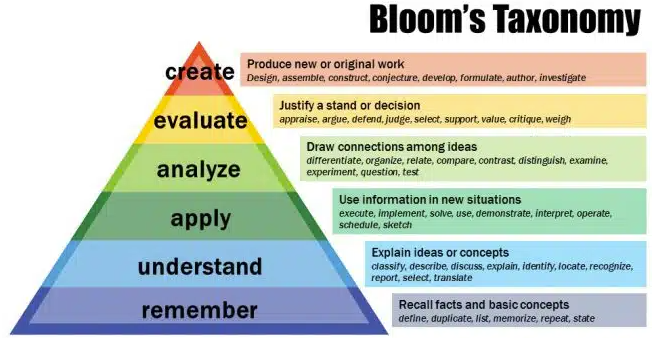

- Bloom’s revised taxonomy helps us identify which thinking processes are needed to achieve higher-order knowledge structures.
	- It describes a progression of cognitive skills, from simple recall of information to the ability to analyze, evaluate, and create.
	- 
		- **Ref:** https://cft.vanderbilt.edu/guides-sub-pages/blooms-taxonomy/
	- If SOLO is a house, Bloom’s is the way we build the house. To build an expert-quality house, we must use expert-quality methods.
	- ------------------------------------
	- **Remembering**: The learner can recall information from memory.
	  collapsed:: true
		- Recall facts and basic concepts
			- ex. define, duplicate, list, memorize, repeat, state
	- **Understanding**: The learner can comprehend the meaning of the information.
	  collapsed:: true
		- Explain ideas or concepts
			- ex. classify, describe, discuss, explain, identify, locate, recognize, report, select, translate
	- **Applying**: The learner can use the information to solve a problem or complete a task.
	  collapsed:: true
		- Use information in new situations
			- ex. execute, implement, solve, use, demonstrate, interpret, operate, schedule, sketch
	- **Analyzing**: The learner can break down complex information into its component parts and identify relationships between them.
	  collapsed:: true
		- Draw connections among ideas
			- ex. differentiate, organize, relate, compare, contrast, distinguish, examine, experiment, question, test
	- **Evaluating**: The learner can make judgments about the value or quality of the information or ideas.
	  collapsed:: true
		- Justify a stand or decision
			- ex. appraise, argue, defend, judge, select, support, value, critique, weigh
	- **Creating**: The learner can combine information or ideas to create something new.
	  collapsed:: true
		- Produce new or original work
			- ex. Design, assemble, construct, conjecture, develop, formulate, author, investigate
	- ---
	- One common misconception around Bloom’s revised taxonomy is that one cannot engage in [[higher-order learning]] without first engaging in lower-order learning.
		- The assumption is that learners must first memorize and understand basic information before moving on to more complex thinking processes like analyzing, evaluating, and creating.
			- However, this is not necessarily true, and in fact, the idea of starting with lower-order learning can be counterproductive.
		-