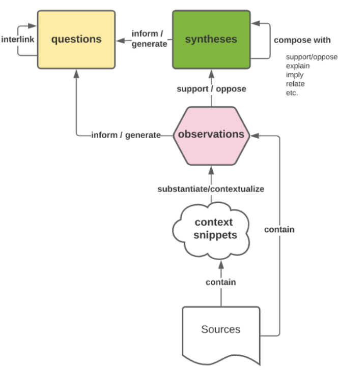

- v0.1
- ---
  title: [[Knowledge synthesis: A conceptual model and practical guide]] 
  tags: [[Thinking Framework]] 
  source: https://oasislab.pubpub.org/pub/54t0y9mk/release/3
  ---
- In this model, we create and update four basic kinds of entities in the synthesis process:
	- **[[Question notes]]**
	  collapsed:: true
		- Question notes express an open question
			- (e.g., *“What is the effect of analogical distance of inspirations on creative output?”*).
		- They can be readily mapped to research questions in research projects.
	- **[[Synthesis notes]]**
	  collapsed:: true
		- Synthesis notes articulate a single, generalized idea, such as a claim
			- (e.g., *“Inspirations that are of intermediate distance from the problem domain strike the best balance between benefits for novelty and quality of ideas”*).
			- In some cases, a synthesis note can encapsulate a more complex single idea, such as a theory
				- (e.g., *“Darwinian theory of evolution by natural selection”*),
				- high level argument
					- (*“Scientific observations are theory-laden”*)
				- or problem
					- (e.g., *“The demarcation problem in philosophy of science”*)
			- By generalized, we mean that synthesis notes should aim at something that is true of an *equivalence class* of instances instead of expressing a bounded statement about a single instance.
		- Synthesis notes can be mapped to citation statements in academic publications, which are typically generalized and drawing on more than a single source.
		- They are also similar in flavor to “claims” in the micropublications model
			- (although it can encompass more complex things than a simple assertion), and “permanent notes” in the Zettelkasten method.
	- **[[Observation notes]]**
	  collapsed:: true
		- Observation notes articulate a single, highly contextualized observation
			- (e.g., *“the finches on the island had different colored beaks after two generations”*).
		- When we say "contextualized," we're talking about observation notes that are tied to specific details like when it happened, who wrote it, and where it took place, rather than trying to describe a general truth that applies to a whole bunch of related things
			- (that's what synthesis notes are for).
		- The idea is to keep observation notes as close to the original facts or "the data" as possible.
			- They should be like the way findings are written down in the results section of a research paper.
		- We usually write these notes in the past tense to remind us when they happened, mention who made the claim where we can (to show it's from their point of view), and try to use less abstract language (to make sure we're focusing on the important details).
		- 3. Observation notes are similar to what's called "literature notes" in the Zettelkasten method or "lines of evidence" in certain argument models used in academic research like the SEPIO model.
	- **[[Context snippet notes]]**
	  collapsed:: true
		- Context snippet notes are used to jot down and describe certain details that help us understand the observation notes better.
		- When we talk about 'contextual details,' we mean things like
			- specific numbers
			- data points
			- tables
			- quotes
		- that form the basis for an observation. It also includes information like
			- who the authors are
			- when it was published
			- where it was published
			- details about the method they used.
		- These bits of information are key to understanding and assessing an observation note.
- Here is a visual diagram of the entities and how they relate to each other to form a system for synthesis.
  collapsed:: true
	- 
	- There is a hierarchical relationship between the artifacts: **question** and **synthesis *_notes (at the top "layer") are supported/opposed/informed by one or more __observation __notes (at the middle "layer"), which are substantiated/contextualized by one or more _*context snippet** notes (at the bottom "layer").
	- Synthesis notes can also be composed into more complex structures (such as arguments or theories or models) through relations with other synthesis notes that vary in complexity from simple "relates to", to implication/explanation and support/opposition.
	- From a practical standpoint, it’s probably most important to implement the typed distinction between entities (synthesis vs. observation vs. context snippet); typed distinctions between relations could significantly enhance the system's ability to augment human synthesis, but significant boosts in synthesis will likely accrue with implementation of only the three distinct artifacts (without explicit typed distinctions between relations).
	- Thus, a minimal implementation of our model will include distinctions between the three types of entities, and explicit (but optionally typed) links between them.
# Examples
	- ### Understanding COVID-19 transmission risks with children
		- In this example, we have:
			- A **[[Synthesis notes]]** that  *“Children are approximately half as likely to contract COVID given equivalent exposure”*
			- An **[[Observation notes]]**from a paper that *“in an exhaustive contact tracing study of 13 families in Central Israel, the COVID secondary attack rates for children < 10yo was ~2x lower than adults”. *This observation note supports the synthesis note.
			- Three **[[Context snippet notes]]**, including a screenshot of the raw descriptive results and test statistics for the differences between age groups, one context snippet about the exhaustive testing regime (i.e., regardless of symptoms), and the number of participants and setting. These context snippets ground the observation note, and are extracted from the paper’s PDF.
			- This bundle of synthesis, observation, and context snippet notes is embedded in a larger network of synthesis/observation/context notes that is focused on understanding the risk of reopening schools for elementary school-aged children (a personal concern of mine!). The following figure demonstrates this. The focal synthesis note we just discussed is highlighted in bold.
			- Here, the focal [[Synthesis notes]] is instantiated as a page.
			- The [[Observation notes]] about secondary attack rates is *transcluded *into (via block reference, and therefore a *part-of*) the synthesis page.
			- The [[Context snippet notes]] are linked to the observation note via indentation in the outline as well as via hyperlinks to their block references, all of which create explicit bi-directional links in the underlying database between the items. Note here also how one of the context snippets includes a crucial detail that the testing regime was exhaustive (regardless of symptoms), which lends additional strength to the observation and how it might support a more informed synthesis claim about COVID transmission risks for children.
			- Both [[Observation notes]] and context snippets are also *part-of* a page dedicated to the particular paper from which they came. In this way, other metadata such as the authors, institutions, year of publication, as well as high-level observations about the paper’s context (e.g., number of citations, status as preprint or peer-reviewed) are also explicitly available as context for the observation note.
	-
	-