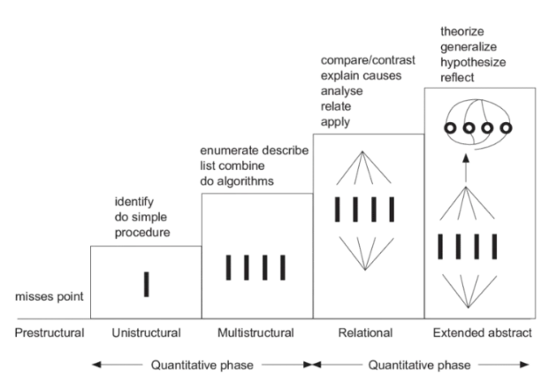

- Stands for Structure of Observed Learning Outcomes
	- is a taxonomy that helps us identify the nature of expert higher-order knowledge structures.
	- It describes a progression of levels of understanding, from simple recall of information to the ability to think abstractly and make connections between ideas.
	- The levels of understanding are:
		- [[Prestructural]] : The learner has no understanding of the topic and responds inappropriately or provides irrelevant information.
		- [[Unistructural]]: The learner has a basic understanding of the topic and can identify one relevant aspect of it.
		- [[Multistructural]]: The learner has a good understanding of the topic and can identify multiple relevant aspects of it.
		- [[Relational]]: The learner can make connections between different aspects of the topic, demonstrating a deep understanding of how they relate to each other.
		- [[Extended Abstract]]: The learner can generalise and transfer their understanding of the topic to new situations, demonstrating a high level of abstraction and creativity.
		- 
			- **Ref: **Rembach, Lauren & Dison, Laura. (2016). Transforming taxonomies into rubrics: Using SOLO in Social Science and Inclusive Education. Perspectives in Education. 34. 68-83. 10.18820/2519593X/pie.v34i1.6.
		- Experts have knowledge that is extended abstract. This is considered a [[Higher-Order Knowledge Structure.]]
		-
		-