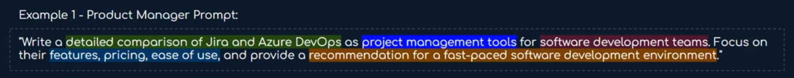
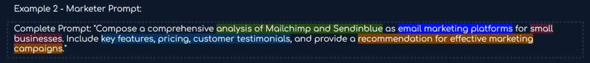
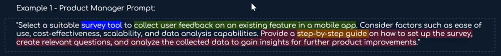

- # [[Thinking Frameworks]] [[Research]]
  collapsed:: true
	- **Create a problem statement**
	  collapsed:: true
		- A concise and clear description of an issue or challenge that needs to be addressed
			- articulates the gap between the current situation and the desired state
		- Define the problem space
			- What is the domain that you are working on?
				- ex. ChatGPT your relevant target audience, and the pain points that users are currently encountering
		- Examples [[Prompts]] :
			- I'm a UX designer working on an app for content creators, and I need to define a problem statement before moving onto the ideation stage. As my UX assistant, you task is to generate a problem statement for me. I'm going to provide you with some data regarding to this app. Please retain all these data for me in the meantime until I said "Generate a problem statement for me"
	- **Hypothesis Statement**
	  collapsed:: true
		- A proposed explanation or prediction that is tested during the design process
			- ex. If we [take this action], then [this outcome] will occur.
		- Example [[Prompts]]
			- Thanks! Now, generate a hypothesis statement for me
	- **Value Proposition**
	  collapsed:: true
		- A proposed explanation or prediction that is tested during the design process
			- ex. If we [take this action], then [this outcome] will occur.
		- Example [[Prompts]]
			- Great! Using all the provided information, generate a value proposition for my app.
- # [[Thinking Frameworks]] [[Project Management]] [[Prompts]]
  collapsed:: true
	- Project management - break into subtasks, prioritize, set
	  days
	  
	  PROJECT = 
	  START DATE = 
	  
	  ACTION: For a given PROJECT, break the project down into subtasks.
	  
	  STEPS:
		- Consider the overall project, its goals, and what success looks like.
		- Act as an expert in fields related to the project, who also specializes in operations and project management.
		- Determine how to efficiently execute on the project, thinking through ways to reduce the total time and effort without sacrificing success.
		- Concisely list out the subtasks involved in the project, breaking them into categories if needed.
		- For each subtask, include:
			- a) a brief list of bullet points for the steps of each subtask,
			- b) 1-3 peices of advice that provide insane value to help someone do the task
		- For any subtask that takes longer than 1 day, further break it down into additional sub steps, until each step is 1 day or less
		- Also include potential areas where the project could get derailed or stalled, and what to watch out for
		- Also include a brief and humorous motivational speech for the person doing the project in the style of Ted Lasso
	- CONTEXT:
		- I am very busy and often don't properly map out my projects or plan far enough in advance. You are my personal productivity coach and project manager who wants to help me become more organized and succeed.
	- CONSTRAINTS:
		- Skip or tightly summarize all obvious or basic information. Waste no words where they are not needed.
	- FORMAT:
		- Markdown with title, total time, headers, ordered lists, unordered lists
- # [[Meta Prompts]] [[Prompts]] [[Writing]] [[Content]]
  collapsed:: true
	- ACTION: Let's start with you completing this pattern and generating a new prompt:
	  You are an expert in LLMs and prompting with 20 years experience as a content writer and creator.
	  Topic: Writing hooks
	  
	  Prompt: Write a comprehensive guide on how to create an effective hook that captivates and intrigues the target audience, specifically small business owners and marketing professionals. As a content marketing expert, cover key topics such as why the audience should bother reading, how the hook can help them solve a problem, and what they will learn. Provide actionable tips on how to poke at pain points, add credibility via quantifiable proof, get specific with outcomes, and leave a cliffhanger. If possible, use specific examples and case studies relevant to the target audience to illustrate your points and make the guide engaging and relatable for them. Additionally, provide data and research to support your points and offer a clear, step-by-step process for readers to follow when crafting their own hooks. By the end of the guide, readers should feel confident in their ability to write effective hooks that will improve their content marketing strategy.
	  
	  Topic: 
	  Prompt:
- # [[Meta Prompts]] [[Prompts]] [[Writing]] [[Email]]
  collapsed:: true
	- ```
	  You are a business professional, I will give you the gist of what I want my writing to contain and you will create an email response based on the following specification:
	  
	  NAME: {You name}
	  
	  STEPS:
	  1. Read the email and draft a response using placeholders (That are in single brackets). Use these placeholder as if they're variables.
	  2. Create a writing signature based on the [WRITING EXAMPLE]. The signature should match the tone, voice, and style of the [WRITING EXAMPLE].
	  3. The reply email is from [Respondent]
	  
	  
	  WRITING EXAMPLE:{INSERT TEXT TO EXTRAPOLATE WRITING SIGNATURE HERE!!!}
	  IDEAS TO INCLUDE: {Center the email around these ideas}
	  EMAIL TO RESPOND TO: {Enter email you received here}
	  ```
- # [[Sites to Remember]]
  collapsed:: true
	- [https://chatgptsplitter.com/](https://chatgptsplitter.com/)
	  id:: 649a732c-6766-4db5-8da6-28b50a33848e
- # [[Workflows]]
  collapsed:: true
	- If you want to break large text down into smaller pieces to use in chatGPT do this:
		- go to ((649a732c-6766-4db5-8da6-28b50a33848e))
		-
- # [[Meta Prompts]] [[Prompts]] [[Summarization]]
  collapsed:: true
	- Video Lesson Transcript
	  
	  INSTRUCTIONS:
	  
	  ACTION: Review and output summaries and critical details of the doc provided as follows
	  
	  STEPS:
	  1) Carefully read the transcript, ignoring all timestamps
	  2) Output a compelling short video title and 1 -sentence description
	  3) Output a very brief outline of the main points of the video
	  4) Include any critical tips in the outline
	  5) Check for any step-by-step explanations or How-tos. Create a brief numbered list detailing the steps to include in the outline
	  
	  VOICE/TONE: Conversational and concise writing 
	  FORMAT: Markdown with headings and ordered/unordered lists
- # [[Thinking Frameworks]]
  collapsed:: true
	- ## [[Instructional Design]]
	  collapsed:: true
		- Instructional prompts typically include clear and explicit directives, such as asking the model to compare and contrast two topics, analyze specific features, provide recommendations, or make a decision based on given criteria. This structure interacts with the AI with the following elements: key prompts, variable niche, end user niche, focus variable, deliverable element.
		- Provides clear instructions and guidance to the Al model for a specific task or problem.
		- This design structure is useful for prompts that require step-by-step guidance or specific actions from the model, and it can incorporate contextual information to guide the model's response.
		- 
		  id:: 649a7b2e-94df-4bb8-8313-02ac055d95e1
		- ### Example 1 - Product Manager Prompt:
		  collapsed:: true
			- 
			- "Write a detailed comparison of Jira and Azure DevOps as project management tools for software development teams. Focus on their features, pricing, ease of use, and provide a recommendation for a fast-paced software development environment."
			- Key Prompt: detailed comparison of Jira and Azure DevOps
			- Variable Niche: project management tools.
			- End User Niche: software development teams.
			- Focus Variable: features, pricing, ease of use,
			- Deliverable Element: recommendation for a last-paced software development environment.
		- ### Example 2 - Marketer Prompt:
		  collapsed:: true
			- 
			- "Compose a comprehensive analysis of Mailchimp and Sendinblue as email marketing platforms for small businesses. Include key features, pricing, customer testimonials, and provide a recommendation for effective marketing campaigns."
			- Key Prompt: Analysis of Mailchimp and Sendinblue
			- Variable Niche: email marketing platforms.
			- End User Niche: small businesses.
			- Focus Variable: Key features, pricing, and customer testimonials.
			- Deliverable Element: Recommendation for effective marketing campaigns.
		- ### Scenario 1:
		  collapsed:: true
			- Imagining that you are working on a prompt engineering project to develop an Al model for generating coding solutions for a programming challenge. Your task is to create an instructive prompt that guides the model to generate a step-by-step solution for a specific coding problem. Here's how you can use the Instructive Design Structure to design a full prompt chain:
			- **Step 1: Identify the Coding Problem**
				- Start by clearly identifying the coding problem that you want the AI model to generate a solution for. In this case, the coding problem is to sort an array of integers in ascending order. Sorting an array is a common task in programming where the elements of an array need to be rearranged in a specific order based on their values.
			- **Step 2: Define the Instructions**
				- "Imagine you are working on a programming challenge to sort an array of integers in ascending order. Your task is to generate a step-by-step solution that outlines the algorithm or approach to achieve this. Follow the instructions below to guide your model."
			- **Step 3: Provide Relevant Context**
				- "Context: You are given an array of integers that need to be sorted in ascending order. The input array may contain duplicate values and can have a maximum length of 10,000 integers. Your solution should be efficient and optimized for time complexity."
			- **Step 4: Specify Expected Deliverables**
				- "Expected Deliverables: Your solution should provide a step-by-step approach to sort the given array of integers in ascending order. Each step should be clearly outlined, including the operations, comparisons, and swaps (if applicable) involved in the sorting process. Pseudocode or actual code snippets are preferred, but a written explanation with a clear and logical flow is also acceptable."
			- **Step 5: Provide Additional Instructions**
				- "Additional Instructions: Make sure to consider edge cases, handle duplicates, and optimize for time complexity in your solution. Clearly explain each step in a concise and logical manner. You may use pseudocode or actual code snippets to illustrate your solution. Avoid using complex or unnecessary operations and keep your solution efficient and optimized."
			- By following this prompt chain, the AI model will have clear instructions, relevant context, and specific expectations to generate a step-by-step solution for sorting an array of integers in ascending order.
			-
		- ### Scenario 2:
		  collapsed:: true
			- Let’s look another case study. Say you are tasked with an automation workflow to connect users. You want to create a prompt for generating a step-by-step automation workflow code that involves registering signups from a landing page into Airtable using Zapier, charging users with Stripe, and sending user data from Airtable to Google Sheets.
			- **Step 1: Identify the Automation Workflow**
				- The automation workflow involves several steps, including registering signups from a landing page made in Webflow into Airtable using Zapier, charging users with Stripe, and sending user data from Airtable to Google Sheets. Use a flow diagram for this.
			- **Step 2: Define the Instructions**
				- "You are working on an automation workflow project to streamline the signup process for a landing page. Your task is to generate a step-by-step automation workflow code that outlines the necessary steps to achieve this. Follow the instructions below to guide your model in generating the solution:
					- “{Webflow}: Retrieve signup data from the {Webflow} landing page form. Use the appropriate API or webhooks to fetch the form data, including user 
					  details such as name, email, and any other relevant information.
					- {Zapier}: Create a Zap in {Zapier} that triggers when new signups are received from {Webflow}. Configure the trigger to receive the form data and 
					  pass it to the subsequent steps in the automation workflow.
					- {Airtable}: Use {Zapier} to create a new record in {Airtable}for each signup. Map the form data fields to the appropriate columns in {Airtable, such 
					  as name, email, and any other relevant fields. Set up the necessary authentication and API key for {Airtable} integration.
					- {Stripe}: Use {Zapier} to create a charge in {Stripe} for each signup. Configure the charge amount and currency based on the product or service 
					  being offered. Set up the necessary authentication and API key for {Stripe} integration
					- {Airtable}: Update the {Airtable} record for each signup with the {Stripe} charge information, such as charge ID, status, and timestamp. Then map 
					  the {Stripe} charge data to the appropriate columns in {Airtable} to keep track of the payment status.
					- {Google Sheets} Use {Zapier} to send the user data from {Airtable} to {Google Sheets} for further analysis or processing. Map the relevant 
					  {Airtable} fields to the appropriate columns in {Google Sheets}. Set up the necessary authentication and API key for {Google Sheets} integration."
			- **Step 3: Provide Relevant Context**
				- "Context: The landing page receives signups from users who are interested in a product or service. The signups need to be registered into {Airtable}  using {Zapier}, and users need to be charged with {Stripe} for the product or service. The user data from {Airtable} also needs to be sent to {Google Sheets} for further analysis and processing."
			- **Step 4: Specify Expected Deliverables**
				- "Expected Deliverables: Your solution should provide a step-by-step automation workflow code that outlines the necessary steps to register signups from the landing page into {Airtable} using {Zapier}, charge users with Stripe, and send user data from {Airtable} to {Google Sheets}. Each step should be clearly outlined, including the APIs, functions, or services involved, and any necessary parameters or configurations. Actual code snippets 
				  with comments explaining the logic are preferred, but a written explanation with a clear and logical flow is also acceptable."
			- **Step 5: Provide Additional Instructions**
				- "Additional Instructions: Make sure to consider error handling, authentication, and data validation in your automation workflow code. Clearly explain each step in a concise and logical manner, including any necessary configurations or settings for each service or API. Use appropriate coding conventions and best practices. Keep your solution efficient, optimized, and secure."
			- >If you are using multi-shot prompting, you can start with one prompt per workflow for each 2 variables (tools) from step 1 then you can create workflow instructions from the model and feed that to step 2
	- ## [[Problem-Solution Design]]
	  collapsed:: true
		- Problem-Solution prompts are designed to identify a specific problem or challenge, and then prompt the model to generate a solution or recommendation to address that problem. This structure interacts with the AI with the following elements: problem statement, solution request, variable niche, deliverable element.
		- 
		- ### Example 1 - Product Manager Prompt:
		  collapsed:: true
			- 
			- "Select a suitable survey tool to collect user feedback on an existing feature in a mobile app. Consider factors such as ease of use, cost-effectiveness, scalability, and data analysis capabilities. Provide a step-by-step guide on how to set up the survey, create relevant questions, and analyze the collected data to gain insights for further product improvements."
			- Problem Statement: collect user feedback on an existing feature in a mobile app.
			- Variable Niche: survey tool
			- Solution Request: Provide a step-by-step guide on how to set up the survey, create relevant questions, and analyze the collected data to gain insights for further product improvements.
			- Deliverable Element: step-by-step guide
		- ### Example 2 - Marketer Prompt:
		  collapsed:: true
			- 
			- "Identify effective strategies to improve social media engagement for a fashion e-commerce brand. Provide a detailed plan including content creation, scheduling, and promotion on Pinterest."
			- Problem Statement: improve social media engagement
			- Variable Niche: effective strategies.
			- Solution Request: Provide a detailed plan including content creation, scheduling, and promotion on Pinterest.
			- Deliverable Element: detailed plan
		- ### Example 3 - E-Commerce
		  collapsed:: true
			- Original Prompt:
				- "Generate innovative solutions to improve customer retention and increase repeat purchases in the e-commerce business."
			- Revised Prompt:
				- "As an e-commerce business owner in the fashion industry (variable niche), you are facing challenges with customer retention and repeat 
				  purchases (key prompt) despite offering competitive pricing, high-quality products, and excellent customer service (focus variable). Your 
				  target end users are fashion-savvy millennials (end user niche), and you want to generate creative strategies and actionable ideas 
				  (deliverable element) to effectively retain customers and boost repeat purchases. Generate a step-by-step plan or a set of innovative 
				  solutions to address this problem and improve your e-commerce business's bottom line."
			- >By making the prompt more specific with details such as the specific industry (fashion), target end users (millennials), and challenges despite competitive pricing, high-quality products, and excellent customer service, the AI model will have a clearer understanding of the context and requirements of the problem. This can result in more focused and relevant solutions, leading to higher quality output.
		- ### Scenario 1:
		  collapsed:: true
			- Let's consider another example in the e-commerce domain, but this time using a Problem-Solution Design Structure to prompt the AI model to generate solutions or insights for a specific challenge:
				- **Problem**:
				  collapsed:: true
					- "As an e-commerce business owner, you are facing challenges in increasing customer retention and repeat purchases on your online store. Your task 
					  is to generate innovative strategies and ideas to overcome this challenge and boost customer loyalty. Provide specific solutions or insights to 
					  address this problem."
				- **Solution**:
				  collapsed:: true
					- **Step 1**:
						- Brainstorm different ways to incentivize repeat purchases and foster customer loyalty. This could include implementing a customer loyalty 
						  program, offering personalized discounts or promotions for repeat customers, or providing exclusive perks or benefits for loyal customers.
					- **Step 2**:
						- Explore strategies to enhance the overall shopping experience on your online store. This could involve optimizing the website's user interface 
						  and navigation, improving product recommendations, simplifying the checkout process, or providing excellent customer service to ensure a smooth 
						  and pleasant shopping experience for customers.
					- **Step 3**:
						- Consider leveraging social media and email marketing to engage with customers and build long-term relationships. This could include 
						  creating engaging content, running targeted email campaigns, and leveraging social media platforms to share updates, promotions, and exclusive 
						  offers to keep customers informed and engaged.
					- **Step 4**:
						- Investigate opportunities to provide exceptional post-purchase experiences to customers. This could include sending personalized thank-you 
						  emails, requesting feedback or reviews, offering easy returns or exchanges, or providing proactive customer support to address any post-purchase 
						  issues or concerns.
					- **Step 5**:
						- Explore collaborations or partnerships with influencers or other complementary brands to expand your reach and attract new customers 
						  while reinforcing loyalty among existing customers. This could involve co-marketing initiatives, joint promotions, or cross-selling opportunities to tap 
						  into new audiences and foster customer retention.”
			- Let’s look the key 5 elements in the problem/solution design structure:
			- 
			- **Key Prompt**: The problem or challenge of customer retention and repeat purchases in the e-commerce business.
			- **Variable Niche**: The specific industry or market segment within the e-commerce industry where the problem is prevalent, such as fashion, electronics, or home goods.
			- **End User Niche**: E-commerce business owners or managers who are facing the problem of customer retention and repeat purchases.
			- **Focus Variable**: The specific aspect or factor related to customer retention and repeat purchases that requires innovative solutions, such as pricing, product quality, customer service, or marketing strategies.
			- **Deliverable Element**: The desired outcome of the generated solutions, which could be a set of actionable ideas, strategic recommendations, or innovative approaches to overcome the problem of customer retention and increase repeat purchases in the e-commerce business.
	- ## [[Scenario-based Design]]
	  collapsed:: true
		- Scenario-based prompts involve setting up a specific scenario or situation for the model to respond to. The scenario can be real or hypothetical and may require the model to provide solutions, suggestions, or insights based on the given context. Interaction with AI via these elements:
			- **Scenario Setup**: Establishing the scenario or situation for the model to respond to.
			- **Contextual Information**: Providing relevant information or data related to the scenario.
			- **Request for Response**: Asking the model to provide solutions, suggestions, or insights based on the given context.
			- **Deliverable Element**: Specifying the expected deliverable, such as a response, recommendation, or analysis.
			- ### Example 1 - as a business/financial analyst:
			  collapsed:: true
				- >Slide didnt provide any color coding
				- **Scenario Setup**:
					- "You are a financial analyst for a multinational corporation planning to expand into a new international market."
				- **Contextual Information**:
					- "The company is seeking an analysis of the economic, political, and financial factors that could impact its financial performance in the new market."
				- **Request for Response**:
					- "Based on the given context, provide insights and recommendations on how to mitigate risks and leverage opportunities for sustainable growth."
				- **Deliverable Element**:
					- "Deliver a comprehensive report outlining your findings and recommendations to the company's leadership team."
				- ```
				  "As a financial analyst for a multinational corporation, you are tasked with evaluating the financial risks and opportunities associated with expanding into a new international market. Please provide a detailed analysis of the economic, political, and financial factors that could impact the company's financial performance in the new market. Your analysis should include recommendations on mitigating risks and leveraging opportunities, keeping in mind the company's goal of achieving sustainable growth while minimizing risks. The expansion plan has a timeline of 5 years. Please deliver a comprehensive report outlining your findings and recommendations to the company's leadership team. Look under attached market research reports and articles in database zipfile 0036 and outline the report into two main sections: findings and recommendations."
				  ```
					- 
						- **Scenario Setup**: As a financial analyst for a multinational corporation, you are tasked with evaluating the financial risks and opportunities associated with expanding into a new international market.
						- **Contextual Information**: Please provide a detailed analysis of the economic, political, and financial factors that could impact the company's financial performance in the new market. Your analysis should include recommendations on mitigating risks and leveraging opportunities, keeping in mind the company's goal of achieving sustainable growth while minimizing risks. The expansion plan has a timeline of 5 years.
						- **Request for Response**: Please deliver a comprehensive report outlining your findings and recommendations to the company's leadership team.
						- **Deliverable Element**: findings and recommendations.
			- ### Scenario 1:
			  collapsed:: true
				- Here is a situation: Imagine you are a marketing manager for a global e-commerce company that sells organic skincare  products. You are facing a challenge in increasing website traffic and converting visitors into customers.
				- **Scenario Setup**: Just copy paste the situation if it is inclusive:
					- ```
					  Imagine you are a marketing manager for a global e-commerce company that sells organic skincare products. You are facing a challenge in increasing website traffic and converting visitors into customers.
					  ```
				- **Contextual Information**:
					- ```
					  Despite implementing various marketing strategies, such as social media campaigns, email marketing, and content marketing, the website traffic has plateaued, and the conversion rate remains low. The company's target audience is health-conscious individuals aged 25-40, who are interested in natural skincare products and prefer sustainable and ethical brands. The company's competitors have been gaining market share, and the management is looking for effective solutions to improve website traffic and conversion rates.
					  ```
				- **Request for Response**:
					- ```
					  As the marketing manager, provide a comprehensive plan or recommendations to increase website traffic and improve conversion rates based on the given context.
					  ```
				- **Deliverable Element**:
					- ```
					  Your deliverable should include a detailed plan or set of recommendations with actionable strategies, including targeting specific keywords, optimizing landing pages, improving user experience, leveraging influencer partnerships, and implementing A/B testing, to address the challenge and achieve the company's marketing goals.
					  ```
			- ### Scenario 2:
				- Say you received the initial output from both ChatGPT and Google BARD, and the stakeholders have requested a second part that involves using the same prompt design structure, here's how you can deliver on that request:
				- **Stakeholder Request**:
					- ```
					  Based on the initial output from ChatGPT and Google BART, we need a comprehensive plan or set of recommendations to implement the suggested strategies and address the marketing challenge.
					  ```
				- **Scenario Setup**:
					- ```
					  Imagine you are the marketing team lead for the global e-commerce company that sells organic skincare products. You have received the initial output, which includes recommendations to increase website traffic and improve conversion rates based on the given context." Assuming you are using different LLMs or AI tools.
					  ```
				- **Contextual Information**:
					- ```
					  "The recommendations include targeting specific keywords, optimizing landing pages, improving user experience, leveraging influencer partnerships, and implementing A/B testing. The company's target audience is health-conscious individuals aged 25-40, interested in natural skincare products and prefers sustainable and ethical brands. The competitors are gaining market share, and the management is looking for effective solutions to improve website traffic and conversion rates."
					  ```
				- **Request for Response**:
					- ```
					  As the marketing team lead, provide a comprehensive plan or set of recommendations to implement the suggested strategies and address the marketing challenge based on the given context and the initial output from ChatGPT & Google BARD. See <file> attached"
					  ```
				- **Deliverable Element**:
					- ```
					  "Your deliverable should include a detailed implementation plan with actionable steps, timelines, and responsibilities assigned for each strategy recommended in <file> attached. Include specific details on how each strategy will be executed, monitored, and optimized for the company's target audience to increase website traffic and improve conversion rates."
					  ```
	- ## [[Comparative Prompts]]
	  collapsed:: true
		- Comparative prompts are designed to instruct the model to compare and contrast entities or concepts, evaluate their differences, and provide a deliverable element that summarizes the findings or recommendations.
		- The comparative design structure is a way of prompting a large language model (LLM) to compare and contrast two or more entities or concepts. It is a powerful tool that can be used to generate insights and understanding of complex topics.
		- The comparative design structure consists of the following elements:
		  collapsed:: true
			- **Entities**:
				- The entities are the things that you want to compare and contrast. They can be people, places, things, ideas, or concepts.
			- **Comparative instruction**:
				- The comparative instruction tells the LLM how to compare and contrast the entities. It can be as simple as asking the LLM to "compare and contrast" the entities, or it can be more specific, such as asking the LLM to "compare and contrast the strengths and weaknesses of each entity."
			- **Optional criteria**:
				- Optional criteria are specific factors that you want the LLM to consider when comparing and contrasting the entities. For example, you might want the LLM to consider the cost, features, and performance of each entity.
			- **Deliverable**:
				- The deliverable is the output that you want the LLM to generate. It can be a list of pros and cons for each entity, a summary of the key differences between the entities, or a recommendation for which entity is the best choice.
		- ### Design Elements for Effective AI Interaction
			- **Entities or Concepts to Compare**: It can be products, features, options, or any other relevant entities.
			- **Comparative Instruction**: This element provides clear instructions on how the model should compare or evaluate the given entities.
			- **Optional Criteria**: This element provides specific criteria or factors that the model should consider while making comparisons. It can include various aspects such as features, benefits, limitations, use cases, and other relevant criteria.
			- **Deliverable Element**: This element specifies the expected deliverable, such as a comparison, evaluation, or analysis, that the model should provide based on the given entities, comparative instruction, and optional criteria.
		- ### Example: Enterprise Sales Analyst Prompt
		  collapsed:: true
			- 
			- "Compare and contrast the 'Lead Scoring' and 'Drip Campaigns' features in Salesforce for the insurance client case client identifier." Evaluate the benefits, limitations, and use cases of these two features, considering factors such as ease of use, customization options, integration with existing systems, scalability, and potential impact on sales and marketing workflows. Provide a detailed comparison and analysis of these features, along with recommendations on the most suitable option for the insurance client. Deliver the findings in a report format similar to the report example attached in file name."
			- **Entities**: 'Lead Scoring' and 'Drip Campaigns' features in Salesforce
			- **Comparative Instruction**: Evaluate the benefits, limitations, and use cases of these two features, considering factors such as ease of use, customization options, integration with existing systems, scalability, and potential impact on sales and marketing workflows.
			- **Optional Criteria**: benefits, limitations, and use cases
			- **Deliverable Element**:
				- detailed comparison and analysis of these features, along with recommendations
				- report format similar to the report example attached
				-
		- ### Scenario 1:
		  collapsed:: true
			- Say for example, you want to use Bard AI tool to compare 2  Facebook ad creatives:
			- ```
			  “Compare and contrast the following two Facebook ad creatives:
			  * Ad Creative 1: A video ad that shows a group of friends having fun at a party. The ad is set to upbeat music and features text overlays that say "Have fun with your friends" and "Get out there and enjoy life!"
			  * Ad Creative 2: A static image ad that shows a woman sitting at her desk, looking stressed. The ad features text overlays that say 
			  "Are you feeling stressed?" and "Try our new stress relief product!"
			  Evaluate the following factors for each ad creative:
			  * **Relevance:** How relevant is the ad creative to the target audience {variable}?
			  * **Engagement:** How likely is the ad creative to engage the target audience {variable}?
			  * **Conversion rate:** How likely is the ad creative to convert the target audience {variable} into customers?”
			  ```
			- This prompt would ask the LLM to compare and contrast two Facebook ad creatives based on three factors: relevance, engagement, and conversion rate. The LLM would then generate a report that compares and contrasts the two ad creatives, and provides a recommendation on 
			  which ad creative is more effective.  Here is another version:
			- ```
			  “Compare and contrast the following two Facebook ad creatives:
			  
			  * Ad 1: A video ad that shows a group of people having fun at a party. The ad is set to upbeat music and features text overlays that say things like "Have fun with your friends" and "Live life to the fullest."
			  
			  * Ad 2: A static image ad that shows a woman looking at a new car. The ad has text overlays that say things like "Drive away in style" and "Get behind the wheel of your dream car today." 
			  
			  Evaluate the following factors for each ad:
			  
			  * **Relevance:** How relevant is the ad to the target audience?
			  * **Compellingness:** How compelling is the ad? Does it grab the viewer's attention and make them want to learn more?
			  * **Clarity:** Is the ad easy to understand?
			  * **Credibility:** Does the ad make the company or product seem credible?
			  * **Call to action:** Does the ad clearly tell the viewer what they should do next?
			  
			  Based on your evaluation, which ad do you think is more effective? Why?
			  
			  **Elements:**
			  * **Entities:** Ad 1, Ad 2, Facebook
			  * **Comparative instruction:** Compare and contrast the two ad creatives based on the following criteria:
			  * Relevance    
			  * Compellingness   
			  * Clarity 
			  * Credibility  
			  * Call to action 
			  * **Optional criteria:** None
			  * **Deliverable:** A written comparison and analysis of the two ad creatives, along with a recommendation on which ad is more effective.”
			  ```
		- ### Scenario 2:
		  collapsed:: true
			- Let’s use the same category comparing two Facebook ads, we can use the same design structure to create a prompt chain.
				- **Prompt 1**:
				  collapsed:: true
					- ```
					  Compare and contrast the following two Facebook ad creatives:
					  
					  Ad 1: A video ad that shows a group of people having fun at a party. The ad is set to upbeat music and features 
					  text overlays that say things like "Have fun with your friends" and "Live life to the fullest."
					  
					  Ad 2: A static image ad that shows a woman looking at a new car. The ad has text overlays that say things like "Drive away in style" and "Get behind the wheel of your dream car today."
					  
					  Evaluate the following factors for each ad:
					  
					  Relevance: How relevant is the ad to the target audience?
					  Compellingness: How compelling is the ad? Does it grab the viewer's attention and make them want to learn more?
					  Clarity: Is the ad easy to understand?
					  Credibility: Does the ad make the company or product seem credible?
					  Call to action: Does the ad clearly tell the viewer what they should do next?
					  ```
				- **Prompt 2**:
				  collapsed:: true
					- Now, based on the evaluation, create a second prompt: 
					   ```
					  Based on your evaluation, which ad do you think is more effective? Why?
					  ```
				- Now, considering the output, adding/deleting more evaluation factors to consider, then create a prompt 3:
				- **Prompt 3**:
				  collapsed:: true
					- ```
					  If you were to create a Facebook ad for your own business, what would you do differently?
					  ```
				- These prompts are sequential and related because they help users to analyze Facebook ads in a systematic way. By evaluating the factors listed in Prompt 1, users can determine which ad is more effective.
				- Prompt 2 then asks users to explain why they think the ad is more effective.
				- Finally, Prompt 3 asks users to think about what they would do differently if they were to create a Facebook ad for their own business.
			- By following these prompts, users can learn to analyze Facebook ads more effectively and make informed decisions about which ads to run
	- ## [[Open-ended Prompt Design]]
	  collapsed:: true
		- Open-ended Prompt Design is a type of design structure used in generating prompts that do not provide specific instructions or constraints, but rather allow the model to generate creative and unrestricted responses. It encourages the model to think freely and generate content without predefined limitations or constraints. This design structure works well with the gradual prompting technique to get a starting point in creative projects.
		- The open-ended design structure is a way of prompting a large language model (LLM) to generate content or responses without specific constraints. It is a powerful tool that can be used to generate insights and understanding of complex topics.
		- The open-ended design structure consists of the following elements:
		- 
			- **Topic/theme**:
				- The topic or theme is the general subject matter that you want the LLM to generate content on. It can be a specific topic, such as "the history of the United States," or it can be a more general topic, such as "the future of artificial intelligence."
			- **Optional context**:
				- Optional context is additional information that you can provide to the LLM to help it generate more relevant and 
				  informative content. For example, you could provide the LLM with a list of keywords or a summary of a research paper.
			- **Open-ended instruction**:
				- The open-ended instruction is a brief statement that tells the LLM what you want it to do. For example, you 
				  could ask the LLM to "write a poem about love" or "explain the concept of entropy."
			- **Deliverable**:
				- The deliverable is the output that you want the LLM to generate. It can be a piece of text, a list of items, a diagram, or a 
				  code snippet.
		- ### Example 1 - UI/UX Designer Text Prompt Interacting with an AI Design Tool
		  collapsed:: true
			- ```
			  "Imagine you are a UI designer working on a new mobile app for a food delivery service. Create a visually appealing and user-friendly design for the app's main screen that promotes ease of use, efficiency, and engagement. Consider the app's target audience, the brand identity, and the user's goals and needs. Feel free to explore different color schemes, typography, layout, and interaction patterns. Provide a detailed description and visual mockup of your design, including explanations of your design choices and how they enhance the overall user experience."
			  ```
			- 
			- Elements for the Al interaction:
				- **Topic or Theme**: new mobile app for a food delivery service.
				- **Open-ended Instruction**: Create a visually appealing and user-friendly design for the app's main screen that promotes ease of use, efficiency, and engagement.
				- **Optional Context**: Consider the app's target audience, the brand identity, and the user's goals and needs.
				- **Deliverable Element**: rovide a detailed description and visual mockup of your design, including explanations of your design choices and how they enhance the overall user experience.
		- ### Scenario 1: Marketing Manager of a Software Company
		  collapsed:: true
			- Let's say that you are a marketing manager for a new software company. You want to create a marketing campaign that will generate interest in your product. You could use the open-ended design structure to prompt an LLM to generate content for your marketing campaign. Here is an example of an open-ended prompt that you could use:
				- ```
				  “Write a blog post that explains the benefits of our new software product. The blog post should be informative and engaging, and it should appeal to our target audience.”
				  ```
				- This prompt provides the LLM with the following information:
					- **Topic/theme**: The topic of the blog post is the benefits of the new software product.
					- **Optional context**: The optional context is the target audience for the blog post.
					- **Open-ended instruction**: The open-ended instruction is to write a blog post that is informative and engaging.
					- **Deliverable**: The deliverable is the blog post itself.
		- ### Scenario 2: Interaction between Prompt Engineer and Entrepreneur
			- Here is a hypothetical scenario* where a prompt engineer can help an entrepreneur unlock an LLM model by creating a prompt chain:
				- **Prompt Engineer**:
					- I'm here to help you create prompts to help you with your 3D modeling project.
				- **Entrepreneur**:
					- I'm really excited about this project, but I'm not sure where to start.
				- **Prompt Engineer**:
					- Let's start by talking about the product you want to create. What is it? What does it do? Who is it for?
				- **Entrepreneur**:
					- The product is a new type of desk that is designed for remote workers. It has a built-in stand for laptops, a storage area for supplies, and a comfortable chair. It is designed for people who work from home and need a comfortable and ergonomic workspace.
				- **Prompt Engineer**:
					- Now, let's talk about the key features of the product. What makes it unique? How will it benefit users?
				- **Entrepreneur**:
					- The key features of the product are its ergonomic design, its built-in storage, and its comfortable chair. The ergonomic design will help users to avoid pain and discomfort, the built-in storage will help users to keep their workspace organized, and the comfortable chair will help users to stay focused and productive.
				- **Prompt Engineer**:
					- Now, let's talk about the challenges of creating a 3D model for this product. What resources do you need? Skills needed?
				- **Entrepreneur**:
					- I will need access to a 3D modeling software program, such as Blender or Maya. I will also need some basic 3D modeling skills.
				- **Prompt Engineer**:
					- Okay, let's talk about your plan for creating the 3D model. What steps will you take? What timeline do you have?
				- **Entrepreneur**:
					- I plan to start by creating a rough sketch of the product. Once I have a rough sketch, I will use a 3D modeling software program to create a more detailed model. I plan to have the 3D model completed within two weeks.
				- **Prompt Engineer**:
					- How about your expectations for the 3D model. What do you hope to achieve?
				- **Entrepreneur**:
					- I hope to create a 3D model that is accurate, detailed, and visually appealing. I also hope to create a 3D model that is easy to use and assemble.
				- ---
				- Now, based on this conversation, We have defined the prompt scope of work. Let’s create a prompt chain using open-ended structure.
				- ---
				- **Instructions for Prompt 1**:
					- ```
					  Describe the product that you want to create. What is it? What does it do? Who is it for?
					  ```
					  **Topic/theme**:
						- The topic or theme of the prompt is the creation of a 3D model for a new product for remote workers.
					- **Optional context**:
						- The optional context is the entrepreneur's background and experience.
					- **Open-ended instruction**:
						- The open-ended instruction is to describe the product in detail.
					- **Deliverable**:
						- The deliverable is a clear understanding of the product, its features and benefits
				- **Instructions for Prompt 2**:
					- ```
					  What are the key features of the product? What makes it unique? How will it benefit users?
					  ```
					- **Topic/theme**:
						- The topic or theme of the prompt is the key features of the product.
					- **Optional context**:
						- The optional context is the entrepreneur's research on similar products.
					- **Open-ended instruction**:
						- The open-ended instruction is to identify the key features of the product and explain how they make the product unique and beneficial to users.
					- **Deliverable**:
						- The deliverable is a list of the key features of the product.
				- **Instructions for Prompt 3**:
					- ```
					  What are the challenges of creating a 3D model for this product? What resources do you need? What skills do you need?
					  ```
					- **Topic/theme**:
						- The topic or theme of the prompt is the challenges involved in creating a 3D model for the product.
					- **Optional context**:
						- The optional context is the entrepreneur's research on 3D modeling.
					- **Open-ended instruction**:
						- The open-ended instruction is to identify the challenges involved in creating 
						  a 3D model for the product and explain what resources and skills are needed to overcome these challenges.
					- **Deliverable**:
						- The deliverable is a list of the challenges involved in creating a 3D model for the product, along with a plan for overcoming these challenges.
				- **Instructions for Prompt 4**:
					- ```
					  What is your plan for creating the 3D model? What steps will you take? What timeline do you have?
					  ```
					- **Topic/theme**:
						- The topic or theme of the prompt is the actionable plan for creating the 3D model.
					- **Optional context**:
						- The optional context is the entrepreneur's research on 3D modeling software and techniques.
					- **Open-ended instruction**:
						- The open-ended instruction is to describe the entrepreneur's plan for creating the 3D model, including the steps they will take and the timeline they have set.
					- **Deliverable**:
						- The deliverable is a detailed plan for creating the 3D model.
				- **Instructions for Prompt 5**:
					- ```
					  These are the expectations for creating the 3D model” {..}. Goals are {..}?
					  ```
					- **Topic/theme**:
						- The topic or theme of the prompt is the entrepreneur's expectations for the 3D model.
					- **Optional context**:
						- The optional context is the model’s research on similar products.
					- **Open-ended instruction**:
						- The open-ended instruction is to describe the entrepreneur's expectations for the 3D model, including what they hope to achieve with the model.
					- **Deliverable**:
						- The deliverable is a list of the entrepreneur's expectations for the 3D model.
				- >By following this prompt chain, the entrepreneur can develop a clear plan for creating a 3D model for a new product for remote workers.
				- Lessons from this exercise:
					- Open-ended prompts can be used to help users to think through complex problems and develop clear plans for action.
				- By carefully crafting prompts, prompt engineers can
					- help people to identify their goals,
					- understand the challenges involved in achieving those goals,
					- and develop a plan for overcoming those challenges.
				- In the case of the entrepreneur/end user, the prompt chain helped them to:
					- Identify their goals for the 3D model.
					- Understand the challenges involved in creating the 3D model.
					- Develop a plan for overcoming those challenges.
					- Key takeaways for  open-ended design structure:
					- When crafting prompts, be clear and concise.
					- Avoid jargon and technical terms - even if it is open-ended
					- Use simple language that is easy to understand.
					- Ask open-ended questions that encourage people to think critically.
					- Provide optional context to help users understand the context of the prompt.
	- ## [[Gradual Prompting]]
	  collapsed:: true
		- ### Definition 1:
		  collapsed:: true
			- A technique in prompt engineering where the prompt is designed to start with a general instruction and then gradually become more specific, allowing the model to generate an outline or structure before providing more detailed instructions. This approach helps in guiding the model towards generating outputs in a structured and organized manner.
				- Example: Let's consider a language model designed to generate a blog post on the topic of "Digital Marketing Strategies". The gradual prompting technique can be applied as follows:
		- ### Definition 2:
		  collapsed:: true
			- Gradual prompting is a technique used in prompt engineering to gradually guide an AI model towards generating desired outputs. It involves starting with simple and general prompts, and then progressively refining and narrowing down the prompts to achieve the desired level of specificity in the model's responses.
		- ### Example Domains:
		  collapsed:: true
			- **Product Manager**
				- Use gradual prompting to generate product ideas, create user stories, and develop product roadmaps.
			- **Business Analyst**
				- Leverage gradual prompting to analyze financial data, generate insights, and create reports.
			- **Equity Research Analyst**
				- Use gradual prompting to analyze stock market trends, generate investment ideas, and forecast financial performance.
		- ### Steps:
		  collapsed:: true
			- **Define Your Objective**
				- The first step in using gradual prompting is to define your objective clearly. What task do you want the language model to perform? Is it generating creative ideas, writing compelling marketing copy, or providing insights on financial data? Identifying your objective is 
				  crucial as it guides the rest of your gradual prompting process.
			- **Action: Plan Your Approach**
				- Once you have a clear objective, plan your approach. Think about the best way to achieve your goal using gradual prompting. Consider the prompt design structure, length, and format that would be most effective for your task. Decide on the key information 
				  you want to convey in the prompts, and how you can guide the model towards generating desired outputs.
			- **Action Plan: Craft Your Prompt Chain**
				- Next, craft your prompt chain. This is a series of prompts that you'll use to guide the language model towards generating the desired outputs. Start with a simple prompt and gradually refine it with each step. You can use shortcuts like "continue from previous," "try 
				  something else," or "refine previous response" to quickly generate prompts and iterate on them for optimal results.
		- ### Example 1:
		  collapsed:: true
			- **General Instruction**: Write a blog post on Digital Marketing Strategies.
				- Start with an introduction explaining the importance of digital marketing in today's business landscape.
				- ```
				  Outline at least 3 key strategies that businesses can implement for effective digital marketing.
				  ```
				- ```
				  For each strategy, provide a brief description, relevant examples, and potential benefits.
				  ```
				- ```
				  Conclude with a summary of the key takeaways and future trends in digital marketing.
				  ```
		- ### Example 2 - Generating Product Ideas:
		  collapsed:: true
			- **Prompt 1:**
				- ```
				  Generate 5 product ideas related to the health and wellness niche.
				  ```
				- **Shortcut Example:**
					- ```
					  Try something else: Generate product names for the top 3 product ideas from the previous prompt.
					  ```
			- **Prompt 2:**
				- ```
				  - Provide more details on the top 3 product ideas from the previous prompt.
				  ```
			- **Prompt 3:**
				- ```
				  Describe the target audience, unique selling points, and potential market size for each of the product ideas from the previous prompt.
				  ```
				- **Shortcut Example:**
					- ```
					  Continue from previous: Describe the target audience, unique selling points, and potential market size for each of the product ideas from the previous prompt.
					  ```
		- ### Scenario 1 - Product Manager:
		  collapsed:: true
			- **Step 1: Define objective**
			  collapsed:: true
				- As a product manager, your task is to create user stories and develop a product roadmap for a new feature in your software product.
			- **Step 2: Action**
			  collapsed:: true
				- To get started with Gradual Prompting, you would identify the key actions required for the task. For example:
					- Identify user needs
					- Define product requirements
					- Prioritize features
					- Create user stories
					- Develop a product roadmap
			- **Step 3: Action Plan**
			  collapsed:: true
				- Next, you would create prompts in a sequential manner to generate ideas and content for each action. Here's an example of how you could use prompts to develop user stories:
					- **Identify user needs:**
						- ```
						  List down the different types of users who would benefit from the new feature.
						  ```
					- **Define product requirements:**
						- ```
						  Describe the key functionalities and features that the new feature should have based on the identified user needs.
						  ```
					- **Prioritize features:**
						- ```
						  Write user stories for the top 3 prioritized features based on the 'As a {user}, I want to {do something} so that I can {achieve a goal}' format.
						  ```
					- **Create user stories:**
						- ```
						  Outline a product roadmap that includes the prioritized features, estimated timelines, and dependencies for development and release.
						  ```
					- **Develop product roadmap:**
						- ```
						  Arrange the product roadmap tasks based on their impact and feasibility.
						  ```
				- >As you progress through the prompts in the last step, you can create a prompt chain by building on the responses from previous prompts to generate user stories and product roadmap content in a systematic and organized manner
			- **Step 4: Prompt Chain:**
			  collapsed:: true
				- As you progress through the prompts, you can create a prompt chain by building on the responses from previous prompts. For example:
				- **Prompt Chain:**
					- ```
					  Describe the key functionalities and features that the new feature should have based on the identified user needs. {response from Prompt 1}.
					  ```
					- ```
					  Now, prioritize these features based on their impact and feasibility. {response from Prompt 3}. 
					  ```
					- ```
					  Next, create user stories for the top 3 prioritized features based on the 'As a {user}, I want to {do something} so that I can {achieve a goal}' format. {response from Prompt 4}. 
					  ```
					- ```
					  Finally, outline a product roadmap that includes the prioritized features, estimated timelines, and dependencies for development and release. {response from Prompt 5}.
					  ```
			- **Step 5: Integration with Asana and Slack:**
			  collapsed:: true
				- This is the step where you execute the final prompt output. You can do the integration with Slack to collaborate with team members and share prompt responses for review and feedback (or any communication tool you using ), and Asana (or any task management tool) to create tasks for each action and track progress. This last step can also be automated if there is workflow built-in within the AI tool you are using - for example as no-coding tools like Zapier or promplanguage, or RPA tools for more complex tasks.
			-
		- ### Short [[Commands]] [[Prompts]]
		  collapsed:: true
			-
				- collapsed:: true
				  ```
				  Continue from previous response
				  ```
					- This prompt instructs the model to generate a continuation of the previous response, allowing for a coherent and contextually relevant response.
				- collapsed:: true
				  ```
				  Try something else
				  ```
					- This prompt encourages the model to explore alternative options or generate responses using different approaches, prompts, or techniques to encourage creativity and diversity in the generated outputs.
				- collapsed:: true
				  ```
				  Refine previous response
				  ```
					- This prompts the model to refine or improve the previous response based on specific criteria or feedback, such as making it more concise, accurate, or relevant.
				- collapsed:: true
				  ```
				  Explore alternative prompts
				  ```
					- This prompt directs the model to generate responses using different prompts or variations of prompts to explore different angles or perspectives in generating responses.
				- collapsed:: true
				  ```
				  Experiment with different parameters
				  ```
					- This prompt encourages the model to generate responses with varying parameters, such as temperature, max length, or other settings, to fine-tune the output based on desired criteria.
				- collapsed:: true
				  ```
				  Consider user intent or preferences
				  ```
					- This prompt reminds the model to take into account the user's intent or preferences in generating responses, aligning the outputs with user expectations or requirements.
		- >Tip: Use bullet points or numbered lists to create an outline in the prompt, providing a clear structure for the model to follow. Gradually move from general instructions to specific details in the prompt, guiding the model towards generating organized and coherent outputs.
	- ## [[Multi-shot Prompting]]
	  collapsed:: true
		- ### Definition 1:
		  collapsed:: true
			- This technique in prompt engineering where the prompt consists of multiple instructions or questions, guiding the model to generate responses for each instruction or question sequentially. This approach allows for multiple inputs to influence the model's output, and it can be effective for generating responses that require a series of steps or a combination of information.
		- ### Definition 2:
		  collapsed:: true
			- Multi-shot prompting is an advanced technique used in natural language processing (NLP) to guide language models, such as GPT or Google Bard in generating coherent and comprehensive responses by providing multiple prompts within the same conversation. It allows for a more interactive and dynamic conversation with the model, allowing for back-and-forth exchanges and enabling the model to generate detailed and contextualized responses.
		- ### Steps:
		  collapsed:: true
			- **Define a base prompt:**
				- Start with a base prompt that sets the context for the conversation and provides a general direction for the desired response.
			- **Provide multiple prompts:**
				- Within the same conversation, provide multiple prompts that focus on specific aspects or questions related to the desired response. These prompts can be sequential or parallel, and can progressively refine or expand on the previous prompts.
			- **Iterate and refine prompts:**
				- Experiment with different prompts and iterate on the responses to steer the model towards generating optimal results. You can adjust the wording, structure, and specificity of the prompts to guide the model in generating more accurate and relevant responses.
			- **Use explicit instructions:**
				- Provide explicit instructions to guide the model in generating the desired type of response. You can specify the format, tone, or style of the response, or ask the model to think step-by-step or debate pros and cons before settling on an answer.
			- >Notes:
			  Gradual prompting is sequential. 
			  Multi-shots starts with a base. 
			  You can combine both techniques. 
			  Gradual prompting involves providing prompts in a sequential manner, 
			  while multi-shot prompting involves providing multiple prompts at once.
		- ### Example 1:
		  collapsed:: true
			- Let's consider a language model designed to provide product recommendations for an e-commerce website. The multi-shot prompting technique can be applied as follows:
				- "Find popular electronics in the 'Computers & Accessories' category."
				- "Filter the results based on customer ratings higher than 4 stars."
				- "Sort the filtered products by price in ascending order."
				- "Finally, display the top 5 recommendations."
		- ### Scenario: Virtual Assistant for Personal Finance
		  collapsed:: true
			- As a virtual assistant for personal finance, you want to generate comprehensive and contextually relevant responses to user queries related to budgeting, savings, and investments. You can use multi-shot prompting to guide the language model in generating accurate and helpful responses.
			- **Base Prompt:**
			  collapsed:: true
				- User:
					- What are some tips for managing personal finances effectively?
				- Virtual Assistant:
					- As a virtual assistant for personal finance, provide a multi-shot response to discuss tips for managing personal finances effectively.
			- **Prompts**
			  collapsed:: true
				- **Prompt 1:**
				  collapsed:: true
					- ```
					  Discuss the importance of budgeting and how it can help in managing personal finances effectively.
					  ```
				- **Prompt 2:**
				  collapsed:: true
					- ```
					  Provide examples of budgeting techniques such as the envelope method, 50/30/20 rule, and zero-based budgeting.
					  ```
				- **Prompt 3:**
				  collapsed:: true
					- ```
					  Share strategies for saving money, such as setting up automatic savings, cutting unnecessary expenses, and investing in a high-interest savings account.
					  ```
				- **Prompt 4:**
				  collapsed:: true
					- ```
					  Discuss the importance of diversifying investments, understanding risk tolerance, and seeking professional advice for long-term financial planning.
					  ```
				- **Prompt 5:**
				  collapsed:: true
					- ```
					  Share insights on managing debt effectively, including paying off high-interest debts first, consolidating debts, and negotiating with creditors.
					  ```
			- **Iteration and Refinement:**
			  collapsed:: true
				- **Virtual Assistant:**
					- "Budgeting is a crucial aspect of managing personal finances effectively. It involves creating a plan to allocate income towards various expenses and savings goals. Some popular budgeting techniques include the envelope method, where you allocate specific amounts of money to different spending categories, the 50/30/20 rule, which suggests allocating 50% of income to needs, 30% to wants, and 20% to savings or debt payments, and zero-based budgeting, where you allocate all your income towards expenses, savings, and debts until you reach zero balance."
				- **User:**
					- "Can you explain more about the envelope method?"
				- **Virtual Assistant:**
					- "Sure! The envelope method is a budgeting technique where you allocate specific amounts of money to different spending categories using physical envelopes or digital tools. For example, you can have envelopes for groceries, rent/mortgage, utilities, entertainment, and savings. Each time you receive income, you put a predetermined amount of money into each envelope, and you can only spend the money in that envelope for that specific category. It helps you stay organized, track your expenses, and prevent overspending in certain categories."
				- **User:**
					- "That's interesting! What are some strategies for saving money?"
				- **Virtual Assistant:**
					- "Great question! There are several strategies for saving money. One is to set up automatic savings, where a certain amount of money is automatically transferred to a separate savings account or investment account each month. Another strategy is to cut unnecessary expenses, such as dining out less frequently or canceling unused subscriptions. You can also consider investing in a high-interest savings account to earn more on your savings. It's essential to regularly review your expenses and savings goals to ensure you're on track to meet your financial objectives." And so on, the conversation continues with the virtual assistant providing more detailed and contextually relevant responses based on the multi-shot prompts provided. Multi-shot prompting can greatly enhance the capabilities of language models in generating comprehensive and relevant 
					  responses in a conversational manner. By providing multiple prompts and refining them iteratively, you can guide the model to generate more accurate and contextually appropriate responses for various applications, such as virtual assistants, customer service bots, content generation, and more.
		- ### Short [[Commands]] [[Prompts]]
		  collapsed:: true
			- ```
			  Continue from previous response
			  ```
				- Example:
					- ```
					  Generate a paragraph describing the benefits of regular exercise. Continue from the previous response and add more details.
					  ```
			- ```
			  Try something else
			  ```
				- Example:
					- ```
					  Write a short story about a young girl who discovers she has magical powers. Try something else to make the story more unique and unexpected.
					  ```
			- ```
			  Refine previous response 
			  ```
				- Example:
					- ```
					  Compose a poem about a serene sunset scene by the beach. Refine the previous response by focusing on the imagery and using more sensory details.
					  ```
			- ```
			  Explore alternative prompts
			  ```
				- Example:
					- ```
					  Generate a list of healthy recipes for a week-long meal plan. Explore alternative prompts, such as 'Recipes for plant-based meals' or 'High-protein meal ideas.'
					  ```
			- ```
			  Experiment with different parameters
			  ```
				- Example:
					- ```
					  Write a product description for a smartwatch. Experiment with different parameters, such as temperature and max length, to generate varying versions of the description.
					  ```
			- ```
			  Consider user intent or preferences
			  ```
				- Example:
					- ```
					  Draft an email inviting a client to a business meeting. Consider the user's intent or preferences, such as the tone, language, and level of formality, for a more personalized email.
					  ```
			- ```
			  Set the context
			  ```
				- This command prompts the model to provide a brief context or introduction for the ongoing conversation or interaction.
			- ```
			  Diversify responses
			  ```
				- This command encourages the model to generate diverse and varied responses by providing different perspectives 
				  or approaches.
			- ```
			  Refine previous response
			  ```
				- This command instructs the model to refine or improve the previous response based on specific criteria or feedback provided.
			- ```
			  Compare options
			  ```
				- This command prompts the model to generate responses that compare and contrast different options or choices.
			- ```
			  Step-by-step thinking
			  ```
				- This command asks the model to think through a problem or task step-by-step before settling on an answer.
			- ```
			  Debate pros and cons
			  ```
				- This command encourages the model to generate responses that present arguments for and against a particular topic or decision.
			- ```
			  Focus on specifics
			  ```
				- This command directs the model to provide more specific and detailed responses related to the user's query or task.
			- ```
			  Consider user preferences
			  ```
				- This command reminds the model to take into account the user's preferences or requirements in generating responses.
		- >Tip: Consider the potential dependencies or interactions between the instructions, and adjust the order or wording accordingly to obtain accurate and relevant responses.
	- ## [[Hierarchy-based Prompting]]
	  collapsed:: true
		- ### Definition 1:
		  collapsed:: true
			- Hierarchy-based prompting involves structuring the prompts in a hierarchical manner, where the model receives prompts with different levels of specificity or abstraction. The prompts are designed to guide the model to generate responses in a step-by-step manner, starting from a high-level overview and gradually moving towards more specific details.
		- ### Definition 2:
		  collapsed:: true
			- Hierarchy-based Prompting is a technique used to guide the model's responses by providing prompts in a hierarchical manner. This approach involves providing high-level prompts to set the context and direction, and then using subsequent prompts to refine and narrow 
			  down the response.
		- ### Steps:
		  collapsed:: true
			- **Define the Hierarchy:**
				- Create a hierarchical structure for the prompts that you will provide to the language model. Start with a base prompt that sets the context and provides a general direction for the desired response. Then, create subsequent prompts that progressively refine or 
				  expand on the previous prompts to guide the model towards generating accurate and relevant responses.
			- **Refine the Prompts:**
				- Experiment with different prompts and iterate on the responses to optimize the results. Adjust the wording, structure, and specificity of the prompts to better guide the model in generating desired responses.
			- **Use Explicit Instructions:**
				- Provide explicit instructions to guide the model in generating the desired type of response. You can specify the format, tone, style, or even ask the model to think step-by-step or debate pros and cons before settling on an answer.
		- ### Example 1:
		  collapsed:: true
			- A user wants to generate a recipe for a dish. The hierarchy-based prompting technique can be applied as follows:
			  collapsed:: true
				- ```
				  Provide an overview of the recipe for <dish name>.
				  ```
				- ```
				  List the main ingredients needed for the recipe.
				  ```
				- ```
				  Describe the steps involved in preparing the dish in detail.
				  ```
			- > In this example, the prompt starts with a high-level overview of the recipe, then moves on to listing the main ingredients, and finally, provides instructions for the preparation steps in detail. The model generates responses based on the hierarchical prompts, providing a structured and organized output that follows the logical order of the recipe preparation process.
		- ### Scenario: Digital Marketing Agency
		  collapsed:: true
			- Let's say you are a digital marketing agency and you want to use Hierarchy-based Prompting to generate social media posts for a new product launch. Your prompts could follow this hierarchy:
				- **Base Prompt:**
					- ```
					  Generate social media posts for a new product launch.
					  ```
				- **Subsequent Prompts:**
					- **Prompt 1:**
						- ```
						  Highlight the features and benefits of the new product.
						  ```
					- **Prompt 2:**
						- ```
						  Include call-to-action phrases to encourage engagement and conversions.
						  ```
					- **Prompt 3:**
						- ```
						  Add hashtags and mentions related to the product's target audience.
						  ```
					- **Prompt 4:**
						- ```
						  Provide variations in tone, such as casual, professional, or humorous, for different social media platforms.
						  ```
					- **Prompt 5:**
						- ```
						  Review and optimize the generated posts for clarity, coherence, and relevance.
						  ```
		- > By using Hierarchy-based Prompting, you can guide the model to generate social media posts that align with your marketing objectives and target audience, while maintaining control over the content and style of the posts.
		- >Note: The main difference between Hierarchy-based Prompting and multi-shot prompting is that Hierarchy-based Prompting uses a hierarchical structure for organizing prompts, while multi-shot prompting allows for more flexibility in the organization and structure of prompts within the conversation.
		- >Tip: Ensure that the prompts are logically ordered and aligned with the desired outcome or domain of the task.
	- ## [[Concept-based Prompting]]
	  collapsed:: true
		- ### Definition 1:
			- Concept-based prompting involves designing prompts that focus on specific concepts or themes related to the desired outcome or domain. The prompts are designed to guide the model to generate responses based on the understanding of key concepts, ideas, or themes associated with the task.
		- ### Definition 2:
			- Concept-based Prompting is a technique used in prompt engineering to create effective prompts for language models that are centered around specific concepts or themes. It involves designing prompts that are focused on conveying the desired concepts to the model, which can result in more accurate and relevant responses.
		- ### Steps:
			- **Identify Relevant Concepts:**
				- Review the course material or specific topics that are relevant to the engineering domain, such as "calculus derivatives" or "electric circuit analysis", and identify key concepts like "chain rule" or "Kirchhoff's laws" that you want to focus on in your prompts.
			- **Design Clear and Specific Prompts:**
				- Create prompts that are tailored to evoke responses related to the identified concepts, 
				  using clear and specific language. Consider incorporating examples, diagrams, or equations to enhance understanding.
			- **Organize Prompts in a Logical Structure:**
				- Organize the prompts in a hierarchical structure or sequence that follows the logical flow of the concepts, ensuring that the prompts are organized in a coherent and meaningful way.
		- ### Example 1: A user wants to generate creative story ideas using concept-based prompting:
			- ```
			  Generate a story idea based on the concept of <specific concept/theme>.
			  ```
			- ```
			  Create a story plot that revolves around the idea of <specific concept/theme>.
			  ```
			- ```
			  Describe the steps involved in preparing the dish in detail.
			  ```
			- The prompts focus on specific concepts or themes related to the desired outcome, such as "love," "adventure," "mystery," or "fantasy." The model generates responses based on the understanding of these concepts, providing story ideas or plots that revolve around the specific concept or theme mentioned in the prompt.
		- ### Scenario: Calculus Quiz Generator
		  collapsed:: true
			- **Step 1: Identify the Variable Concepts. In this case: calculus concepts:**
				- Review the course material and identify key calculus concepts to include in the quizzes.
				- Example prompts:
					- "Generate a calculus quiz on derivatives"
					- "Create a quiz on integration techniques"
					- "Build a quiz on limits and continuity."
				- Practical tips:
					- Ensure that the selected concepts align with the learning objectives of the course and cover a wide range of difficulty levels.
			- **Step 2: Design Concept-based Prompts:**
				- Create prompts that are designed to evoke responses related to the identified calculus concepts.
				- Example prompts:
					- "Explain the chain rule in calculus"
					- "Describe the process of solving definite integrals"
					- "Illustrate the concept of differentiability in calculus."
				- Practical tips:
					- Use clear and specific language in your prompts, & consider incorporating examples, diagrams, or equations to enhance the understanding of the concept.
			- **Step 3: Organize the Prompts in a Chain (Prompt chain):**
				- Organize the prompts in a hierarchical structure or sequence that follows the logical flow of the calculus concepts.
				- Example Prompt Chain:
					- "Derivatives" -> "Integration Techniques" -> "Limits and Continuity"
				- Practical tips:
					- Consider the order of prompts in the PrompChain to ensure that they flow naturally and logically, and allow for easy comprehension by the user.
			- **Step 4: Test and Refine the Prompts:**
				- Test the PrompChain with different inputs and iterate on the prompts to refine their effectiveness.
				- Example prompts:
					- "What is the derivative of f(x) = x^2 + 3x - 5?"
					- "Evaluate the definite integral of g(x) = 2x^3 + 4x^2 - 7x + 10 from x=0 to x=2."
				- Practical tips:
					- Continuously evaluate and refine the prompts based on user feedback, performance metrics, and the desired output from the app.
			- **Step 5: Incorporate into the App:**
				- Integrate the Prompt Chain into the app's code or user interface, allowing users to interact with the prompts and generate calculus quizzes automatically.
				- Example implementation:
					- Incorporate the PrompChain as a series of prompts in the app's user interface, where users can select the desired calculus concept and generate a quiz based on their selection.
				- Practical tips:
					- Ensure that the app's interface is user-friendly and intuitive, providing clear instructions on how to interact with the prompts and generate quizzes effectively.
			- **Step 6: Test and Deploy the App:**
				- Test the app with real-world users and deploy it to production once it meets the desired performance and user experience standards.
					- Example testing:
						- Have a group of students or instructors test the app and provide feedback on the generated quizzes' accuracy, relevance, and difficulty level.
					- Practical tips:
						- Continuously monitor the app's performance, gather feedback from users, and make necessary updates or improvements to ensure its effectiveness and reliability.
		- >Tip: Design prompts that explicitly mention these concepts or themes to guide the model in generating responses that align with the desired focus. Try to use creative and engaging language in prompts to stimulate the model's imagination and encourage it to generate unique and diverse ideas.
	- ## [[Adversarial Prompting]]
	  collapsed:: true
		- ### Definition 1:
		  collapsed:: true
			- Adversarial prompting involves designing prompts that challenge the model to generate responses that are resistant to potential biases or limitations. The prompts are designed to push the model to think critically and consider multiple perspectives, promoting more balanced and unbiased outputs.
		- ### Definition 2:
		  collapsed:: true
			- Adversarial Prompting is a technique used in prompt engineering where prompts are designed to provide a challenging or conflicting context to the language model, with the aim of improving the model's robustness and ability to handle diverse perspectives. Adversarial prompts are designed to present multiple viewpoints or opposing arguments, often used in situations where debate, decision making, negotiation, or other scenarios require the model to consider different perspectives and generate balanced responses.
		- ### How does it work?
		  collapsed:: true
			- Adversarial Prompting works by presenting prompts that introduce contrasting or conflicting information, opinions, or scenarios, challenging the language model to generate responses that are nuanced and balanced. By exposing the model to diverse and opposing viewpoints, adversarial prompting can help the model to learn to consider multiple perspectives and generate responses that are less biased or one-sided.
		- ### Best use situations?
		  collapsed:: true
			- Adversarial Prompting is best used in situations where the goal is to encourage critical thinking, unbiased decision making, or balanced responses. Some situations where Adversarial Prompting can be useful include:
				- **Debate scenarios:**
				  collapsed:: true
					- Presenting prompts that introduce contrasting viewpoints or arguments, encouraging the model to generate balanced responses by considering both sides of the debate.
						- Example:
							- ```
							  Debate the pros and cons of renewable energy sources versus fossil fuels.
							  ```
				- **Decision-making scenarios:**
				  collapsed:: true
					- Designing prompts that present different options or perspectives, guiding the model to generate responses that weigh pros and cons, and provide balanced insights for decision making.
						- Example:
							- ```
							  Compare and contrast the advantages and disadvantages of different programming languages for a particular application.
							  ```
				- **Negotiation scenarios:**
				  collapsed:: true
					- Using prompts that present conflicting interests or perspectives, encouraging the model to generate responses that consider the interests of all parties involved and facilitate negotiation.
						- Example:
							- ```
							  Negotiate a fair and mutually beneficial agreement between two parties with conflicting interests.
							  ```
		- ### Steps
		  collapsed:: true
			- **Step 1: Understand the Story Context and Goal**
			  id:: 64a0ee4b-3193-4996-b9be-4758b35ed0d7
				- Start by understanding the specific story context and the goal of the journalist. Review the story material, the desired tone, and the intended message of the story. Identify any areas where the LLM can be challenged to generate more balanced and nuanced responses. Here is a template for this: For the news story on the controversial political topic, the journalist should identify the key concepts and arguments for both sides of the debate, as well as any potential biases or assumptions in the story.
			- **Step 2: Design Adversarial Prompts**
			  id:: 6837ccb0-b4a5-4411-91da-50e8eaff76ae
				- Design prompts that introduce conflicting or contrasting information, opinions, or scenarios related to the story context. These prompts should challenge the LLM to consider different viewpoints and generate responses that are nuanced and balanced.
			- **Step 3: Organize Prompts in a Logical Structure**
			  id:: 64a0efcd-4a01-4bfb-a978-b07ca2825b84
				- Organize the prompts in a hierarchical structure or sequence that follows the logical flow of the story context. Ensure that the prompts are organized in a coherent and meaningful way, challenging the LLM to consider multiple perspectives and generate balanced responses.
			- **Practical Tips:**
				- 1. Use clear and specific language in your prompts.
				  2. Incorporate contrasting viewpoints, arguments, or scenarios related to the story.
				  3. Present different options or perspectives for the LLM to consider.
				  4. Use examples, data, or facts to enhance the credibility of the prompts.
		- ### Scenario: Adversarial Prompting for a news agency
		  collapsed:: true
			- **Context:**
				- As a prompt engineer, your task is to design prompts that challenge the Language Models at the backend to generate more nuanced and balanced responses in the context of journalism. Adversarial Prompting here can help journalists refine their stories by exposing LLMs to conflicting or contrasting information
				- **Details:**
					- Let’s explore how to implement adversarial prompting in prompting engineering for journalists
				- >Note: Steps 1 and 3 are only conceptual and dont have any actual prompt example.
				- ((64a0ee4b-3193-4996-b9be-4758b35ed0d7))
				  collapsed:: true
					-
				- ((6837ccb0-b4a5-4411-91da-50e8eaff76ae))
				  collapsed:: true
					- Template: For the news story on the controversial political topic, journalists can use the following prompts:
						- **Prompt 1:**
							- ```
							  Provide arguments in favor of one side of the political debate.
							  ```
						- **Prompt 2:**
							- ```
							  Now, present arguments in favor of the opposing side of the debate.
							  ```
						- **Prompt 3:**
							- ```
							  Highlight any potential biases or assumptions in the story and provide alternative perspectives.
							  ```
					-
				- ((64a0efcd-4a01-4bfb-a978-b07ca2825b84))
			- ---
				- **Practical Tips: For creating prompts**
					- 1. Use a logical order that aligns with the story structure and flow.
					  2. Consider the context of each prompt and its relevance to the story.
					  3. Ensure that prompts are clear and easy to understand.
					- **Template:**
						- For the news story, journalists can organize the prompts in a logical structure, such as:
						- **Prompt 1:**
							- ```
							  Present arguments in favor of one side of the political debate.
							  ```
						- **Prompt 2:**
							- ```
							  Present arguments in favor of the opposing side of the debate.
							  ```
						- **Prompt 3:**
							- ```
							  Highlight any potential biases or assumptions in the story and provide alternative perspectives.
							  ```
		- Example: Let's say a language model is designed to provide customer service responses. The adversarial prompting technique would work as follows:
			- "Provide a response to a customer inquiry while avoiding any biased language or assumptions."
			- "Offer a solution to a customer issue that considers multiple perspectives and promotes inclusivity."
			- "Generate a customer service response that demonstrates empathy, fairness, and neutrality."
		- See how this prompt challenges the model to avoid biased language, assumptions, or perspectives while generating customer service responses. The model is encouraged to think critically and provide balanced and unbiased outputs, considering multiple perspectives and promoting inclusivity.
		- >Tip: First, identify potential biases, limitations, or assumptions that may arise in the model's responses. Then, design prompts that explicitly challenge the model to avoid biased language, assumptions, or perspectives.
	- ## [[Dynamic Prompting]]
	  collapsed:: true
		- ### Definition 1:
		  collapsed:: true
			- Dynamic prompting involves adjusting or updating prompts in real-time based on the model's responses or user feedback. This technique allows prompt engineers to iteratively refine prompts during the model's interactions to improve its performance and ensure desired outputs.
		- ### Definition 2:
		  collapsed:: true
			- This technique used in prompt engineering where prompts are generated dynamically based on the context or input provided to the language model. Instead of using fixed or pre-designed prompts, dynamic prompting allows for the generation of prompts on-the-fly, tailored to the specific input or context.
		- ### How does it work?
		  collapsed:: true
			- Dynamic prompting works by analyzing the input or context provided to the language model and generating prompts based on that information. This can be achieved by extracting relevant keywords, phrases, or entities from the input, and using them to construct prompts that are more aligned with the specific task or query at hand. Dynamic prompts can be generated using various techniques, such as template-based prompting, keyword extraction, or natural language 
			  processing (NLP) algorithms.
		- ### Best use situation
		  collapsed:: true
			- Dynamic prompting is best used in situations where the input or context provided to the language model may vary significantly, and fixed prompts may not be effective in capturing the desired information. It is particularly useful in scenarios where the prompt needs to be tailored to the specific context or task, and the input data may be dynamic, changing from one query to another.
		- ### Example: Let's simplify an example where a user wants to create a story.
		  collapsed:: true
			- **Prompt 1:**
				- ```
				  Start a story with an introduction to a character and a setting, and continue the story based on the model's generated response.
				  ```
			- **Prompt 2:**
				- ```
				  Continue the story by incorporating elements of mystery and suspense, and use the model's responses to guide the story's direction.
				  ```
			- **Prompt 3:**
				- ```
				  Update the prompt to include specific story elements or plot twists based on user feedback or the model's performance.
				  ```
			- >In this example, the prompts are designed to be dynamic, allowing prompt engineers to iteratively adjust or update the prompts based on the model's generated responses or user feedback. This technique enables prompt engineers to refine prompts in real-time, improving the model's performance and ensuring that the generated stories meet the desired creative criteria.
		- ### Scenario: Business Guide
		  collapsed:: true
			- Imagine you have a language model that is designed to generate product descriptions based on input data. Instead of using fixed prompts, you implement dynamic prompting by analyzing the product name, features, and other relevant information from the input data. You then generate prompts such as
				- ```
				  Write a description for a product named {product_name} with the following features: {product_features}.
				  ```
				- This way, the prompts are generated dynamically based on the specific product name and features, allowing the language model to generate more accurate and relevant descriptions tailored to the input data.
			- Say you are tasked to generate news article summaries using a language model using dynamic prompting to generate prompts based on the input news article. Here's how the process might look:
			- **Task: Generating News Article Summaries:**
				- The goal is to generate summaries of news articles using a language model.
				- **Input Data: News Article**
					- Title: "Scientists Discover New Species of Orchid in Amazon Rainforest"
					- Content: "A team of scientists from the University of XYZ has discovered a new species of orchid in the Amazon rainforest. The orchid, named Orchidaceae Amazoniensis, is known for its vibrant purple color and unique petal structure. This discovery marks an important contribution to the field of botany and underscores the importance of preserving the biodiversity of the Amazon rainforest."
				- We can generate prompts based on the input news article. In this example, the prompt can be:
					- ```
					  Title: "Scientists Discover New Species of Orchid in Amazon Rainforest"
					  
					  Content: "A team of scientists from the University of XYZ has discovered a new species of orchid in the Amazon rainforest. The orchid, named Orchidaceae Amazoniensis, is known for its vibrant purple color and unique petal structure. This discovery marks an important contribution to the field of botany and underscores the importance of preserving the biodiversity of the Amazon rainforest."
					  
					  Generate a summary for the news article titled {Title}.
					  ```
				- >The dynamic prompt is generated by extracting the title of the news article and using it as part of the prompt. This way, the language model is prompted 
				  to generate a summary specifically tailored to the input news article.
				- **Sample Generated Summary:**
					- The language model generates a summary based on the dynamic prompt. Here's a sample output:
					- **Summary:**
						- "Scientists from the University of XYZ have discovered a new species of orchid in the Amazon rainforest. Named Orchidaceae Amazoniensis, this vibrant purple orchid with a unique petal structure adds to the biodiversity of the Amazon rainforest, making it an important find in the field of botany."
					- The generated summary is specific to the input news article and provides a concise and relevant summary based on the dynamic prompt generated from the input data.
					  Section 2 -  Techniques for Crafting Effective Prompts
		- >Tip: Use dynamic prompting as an iterative process to refine prompts and improve the model's performance over time.
	- ## [[Prompt Augmentation]] #Revisit
	  collapsed:: true
		- ### Definition 1:
		  collapsed:: true
			- Prompt augmentation involves adding variations or modifications to prompts to enhance the model's ability to generate diverse and relevant outputs. This technique expands the prompts to cover a wider range of possibilities, leading to more creative and diverse outputs from the model.
		- ### Definition 2:
		  collapsed:: true
			- Prompt augmentation is a technique used in natural language processing (NLP) to enhance the effectiveness of prompts provided to language models by adding additional information or variations to the original prompts. This technique aims to improve the quality, diversity, and relevance of the generated responses.
		- ### Steps:
		  collapsed:: true
			- **Identify Relevant Concepts or Variations**
				- Review the original prompts or specific topics of interest and identify relevant concepts, variations, or alternative ways to phrase the prompts.
			- **Generate Augmented Prompts**
				- Use techniques such as paraphrasing, synonym substitution, or rephrasing to create multiple augmented prompts that incorporate the identified concepts or variations. These augmented prompts can provide additional context or different perspectives to the 
				  language model.
			- **Combine Original and Augmented Prompts**
				- Combine the original prompts with the augmented prompts to create a larger set of prompts that can be used as input to the language model.
			- **Input to Language Model**
				- Pass the combined set of prompts as input to the language model API, along with any other required parameters such as temperature or max tokens, to generate responses.
			- **Evaluate and Select Responses**
				- Evaluate the generated responses based on the desired criteria such as relevance, coherence, or diversity, and select the most appropriate responses for further use.
		- ### Example: Generate product descriptions for an e-commerce site.
		  collapsed:: true
			- **Prompt 1:**
				- ```
				  Write a product description for a smartphone with a focus on its features, specifications, and benefits.
				  ```
			- **Prompt 2:**
				- ```
				  Add variations to the prompt by modifying the emphasis on different features or aspects of the smartphone, such as camera quality, battery life, or design.
				  ```
			- **Prompt 3:**
				- ```
				  Include different language styles or tones in the prompt, such as formal, casual, technical, or persuasive, to guide the model's tone in the generated product descriptions.
				  ```
			- >Prompt engineers can augment the prompts by adding variations or modifications that cover different aspects, features, or language styles, allowing the model to generate diverse and relevant product descriptions based on the modified prompts.
		- ### Scenario: Business Guide
		  collapsed:: true
			- Let's say you are using a language model to generate product descriptions for an e-commerce website. The original prompt is
				- ```
				  Write a product description for a red dress.
				  ```
				- Using prompt augmentation, you can generate augmented prompts by adding variations such as:
					- **Variation 1:**
						- ```
						  Write a product description for a red gown.
						  ```
					- **Variation 2:**
						- ```
						  Compose a product description for a crimson dress.
						  ```
					- **Variation 3:**
						- ```
						  Generate a product description for a scarlet dress.
						  ```
				- >These augmented prompts provide additional variations of the original prompt, which can result in more diverse and creative product descriptions from the language model.
		- ### Scenario: Technical Guide (Fetching data within books for data requestors)
		  collapsed:: true
			- As a prompt engineer, you are working with a librarian to generate prompt augmentations for data requestors to fetch data within books. The librarian wants the process to be repeated. so this is the task: Fetching data within books for data requestors.
			- You want to start with a prompt template for future use since this will is asked - example:
				- ```
				  Fetch data from books about [topic/subject] for [data requestor] using [search query or method].
				  
				  topic/subject = 
				  data requestor = 
				  search query or method = 
				  ```
			- Then you generate Prompt variations - here are few examples:
			  collapsed:: true
				- **Variation 1:**
					- ```
					  Fetch information from books about [topic/subject] for [data requestor] using [search query or method].
					  ```
				- **Variation 2:**
					- ```
					  Retrieve data from books related to [topic/subject] for [data requestor] using [search query or method].
					  ```
				- **Variation 3:**
					- ```
					  Get data from books on [topic/subject] for [data requestor] using [search query or method].
					  ```
				- **Variation 4:**
					- ```
					  Extract information from books about [topic/subject] for [data requestor] using [search query or method].
					  ```
			- Using the templates, the librarian can just plug and play variables into the prompt templates.
			  collapsed:: true
				- ```
				  Fetch data from books about history for research purposes using keywords [keywords].
				  
				  keywords = world wars
				  ```
				- ```
				  Retrieve data from books related to biology for a student project using search query [search query].
				  
				  search query = cellular respiration
				  ```
				- ```
				  Get data from books on astronomy for a science enthusiast using search method [search method].
				  
				  search method = by author
				  ```
				- ```
				  Extract information from books about literature for a book club using prompt [prompt].
				  
				  prompt = best-selling novels
				  ```
		- >Revisit this architecture in future for understanding the variable(s)
		- >Prompt augmentation can be a powerful technique to improve the performance & versatility of any LLM - by providing them with additional context, variations, or perspectives. However, it's important to carefully review and test the augmented prompts to ensure they are relevant, accurate, and aligned with the desired outcomes of your task or any application you are creating, or working with.
		- >Tip: Experiment with different variations or modifications to the prompts to enhance the model's ability to generate diverse and relevant outputs. Consider adding different language styles, tones, or emphasis on different aspects of the prompt to guide the model's behavior.
	- ## [[Fill in the Blank Prompting]] #Redefine
	  collapsed:: true
		- ### Definition 1:
		  collapsed:: true
			- Fill-in-the-blank prompting is a type of dynamic prompting technique where certain parts of a prompt are left blank for users, or for the model, to fill in with specific information. This allows for customization and personalization of prompts based on user input or other contextual information. Fill-in-the-blank prompts typically contain placeholders or variables that can be replaced with appropriate values or data.
		- ### Examples:
			- Personalized emails:
				- An email marketing campaign that uses fill-in-the-blank prompts to dynamically insert each recipient's name, location, or other relevant information in the email content, creating a personalized experience.
					- Example:
						- "Hi [Name], we're excited to offer you a special discount on our latest [Product] in [Location]. Don't miss out!"
				- Online forms:
					- Web forms that utilize fill-in-the-blank prompts to collect user information, such as name, email address, and phone number, by presenting blank fields for users to input their data.
					- Example:
						- "Please provide your [Name], [Email Address], and [Phone Number] in the fields below to sign up for our newsletter."
				- Content creation:
					- Content generation tools that use fill-in-the-blank prompts to help users create custom content, such as articles, blog posts, or social media posts, by providing templates with blank spaces to fill in with relevant details.
					- Example:
						- "Write a blog post about [Topic]. Include [Number] key tips for [Audience], and end with a call-to-action for [Action]."
	- ## [[Constraint Prompting]]
	  collapsed:: true
		- ### Definition 1:
		  collapsed:: true
			- Constraint Prompting is a technique used in language models, such as ChatGPT, to guide the model's output by imposing certain constraints or rules during the generation process. This technique involves embedding constraints in the prompt or input to the model, which helps to shape the generated output based on specific criteria or requirements.
		- ### Definition 2:
			- A technique used in language models to embed constraints in the prompt to guide the model's output.
			- **Purpose**
				- To guide the model in generating outputs that adhere to specific constraints or requirements.
			- **Input**
				- Typically includes a prompt or instruction that includes the constraint or requirement, which can be in the form of an equation, condition, or specification.
			- **Example**
				- ```
				  Generate a list of items with a total cost not exceeding $100.
				  ```
			- **Model Output**
				- The model will generate a list of items with their corresponding costs, ensuring that the total cost does not exceed $100.
			- **Practical Tips:**
				- 1. Be specific and clear in expressing the constraint in the prompt.
				- 2. Use appropriate syntax and formatting to convey the constraint effectively.
				- 3. Experiment with different constraint formulations to achieve desired results.
			- **Application**
				- Constraint prompting can be used in various domains, such as finance, accounting, inventory management, scheduling, and content generation, where specific constraints or requirements need to be met in the generated output. It provides the following benefits:
			- **Benefits**
				- 1. Provides more control over the model's output to ensure compliance with specific constraints.
				- 2. Enables customization of model behavior to align with desired outcomes.
				- 3. Facilitates the generation of outputs that meet specific business or domain requirements.
			- **Limitations**
				- 1. Models may not always fully understand or interpret the constraints correctly.
				- 2. Constraint prompting may limit the model's creativity or ability to generate diverse outputs.
				- 3. Fine-tuning or additional training may be required to optimize constraint prompting for certain tasks or constraints.
		- ### Steps:
		  collapsed:: true
			- **Define the constraints**
				- Identify the specific constraints or rules that you want to impose on the model's output. These constraints could be related to the format, style, or content of the generated text.
			- **Embed constraints in the prompt**
				- Integrate the constraints into the prompt or input provided to the language model. This can be done by adding explicit instructions, keywords, or placeholders in the text that indicate the desired constraints.
			- **Leverage model capabilities**
				- Utilize the capabilities of the language model to interpret and process the embedded constraints. For example, if using ChatGPT, you can take advantage of its prompt engineering techniques, such as providing explicit instruction or using system messages, to guide the model's behavior.
			- **Experiment & iterate**
				- Again, as always, experiment! play with different variations of prompts and constraints to fine-tune the model's output according to your desired results. Iteratively refine \& adjust the constraints based on the generated outputs.
		- ### Best use situations
		  collapsed:: true
			- Constraint prompting can be a valuable technique in various use cases where you want to guide the output of a language model to adhere to specific constraints or guidelines. Some potential best use cases for constraint prompting include:
				- **Content Generation:**
					- Generating content for specific purposes, such as creating product descriptions, social media posts, or news articles, while adhering to specific guidelines, brand tone, or legal constraints.
				- **Language Translation:**
					- Generating translations while adhering to specific grammar rules, cultural nuances, or language-specific constraints.
				- **Code Generation:**
					- Generating code snippets or programming scripts that follow specific coding conventions, syntax rules, or coding standards.
				- **Data Generation:**
					- Generating synthetic data for testing or training purposes, while adhering to specific data formats, distributions, or privacy constraints.
				- **Storytelling:**
					- Generating narratives or stories that adhere to specific plot structures, character traits, or storytelling rules.
				- **Legal Writing:**
					- Generating legal documents, contracts, or agreements that follow specific legal language, formats, or regulations.
				- **Educational Content:**
					- Generating educational materials, quizzes, or assessments that adhere to specific learning objectives, educational standards, or instructional guidelines.
		- ### Scenario: Accountant (Overview)
		  collapsed:: true
			- **1. Define the constraints**
			  collapsed:: true
				- In this case, the constraints could be related to the format, accuracy, and compliance of financial statements or reports.
				- >For example, ensuring that the generated text includes accurate financial data, follows the Generally Accepted Accounting Principles (GAAP), and complies with relevant tax laws and regulations.
			- **2. Embed constraints in the prompt**
			  collapsed:: true
				- The accountant could provide a prompt that includes specific instructions and placeholders for the required financial information, such as
					- ```
					  Generate a balance sheet report for XYZ Company as of [DATE] in compliance with GAAP, including the following line items: [LIST OF LINE ITEMS].
					  ```
					- >The prompt can also include instructions to ensure the accuracy and compliance of the generated report.
			- **3. Leverage model capabilities**
			  collapsed:: true
				- The language model, such as ChatGPT, can interpret the embedded constraints and generate text that adheres to the provided instructions. For example, it can generate a balance sheet report with the requested line items, accurate financial data, and compliance with GAAP and relevant regulations.
			- **4. Experiment and iterate**
			  collapsed:: true
				- The accountant can experiment with different variations of prompts and constraints to fine-tune the model's output. They can adjust the constraints based on the generated report and feedback from users, and iterate to achieve the desired level of accuracy and compliance in the generated financial statements.
		- ### Scenario: Accountant (Detailed)
		  collapsed:: true
			- **Task:**
			  collapsed:: true
				- Let’s s take the previous example further. Assume the Financial LLM you are working with can pull detailed financial items from the database. You are tasked to help the accountant with this process using constraint prompting:
				- **Prompt Engineer Role:**
				- **1. Define the Constraint Prompt:**
					- Design a constraint prompt that specifies the desired financial items to be generated, such as the balance sheet for XYZ Company with assets, liabilities, and equity, and provide clear instructions on how to use the prompt.
				- **2. Generate the Prompt:**
					- Generate the constraint prompt with placeholders for the actual values of assets and liabilities, e.g.,
					- ```
					  Generate a balance sheet for XYZ Company as of April 30, 2023, with assets of $_ and liabilities of $_ in compliance with GAAP.
					  ```
					- **Provide Instructions:**
						- Share the prompt and instructions with the accountant on how to input the actual values for assets and liabilities.
				- **Accountant Role:**
					- **1. Provide Inputs:**
						- Use the constraint prompt provided by the prompt engineer to input the actual values for assets and liabilities from the client database, e.g.,
						- ```
						  Assets = Liabilities + Equity. Assets: $500,000 and Liabilities: $200,000.
						  ```
					- **2. Generate Outputs:**
						- Use the language model to generate the balance sheet based on the inputs provided and the constraints defined in the prompt.
					- **3. Review and Validate:**
						- Review the generated balance sheet to ensure it adheres to the specific constraints and requirements. Validate the accuracy of the results against financial standards and perform calculations to ensure the liabilities balance.
				- Collaborative Iteration:
					- **Feedback and Refinement:**
						- If any adjustments or modifications are needed, provide feedback to the prompt engineer, who can refine the constraint prompt or instructions accordingly to further improve the accuracy and quality of the generated outputs.
					- **Iterative Process:**
						- Continue the collaborative iteration process between the prompt engineer and the accountant until the desired balance sheet with balanced assets and liabilities is generated.
- # [[Prompt Engineering Tips]]
  collapsed:: true
	- ## Key Takeaways
		- ## [[Instructive Design Structure]]
		  collapsed:: true
			- Provides clear instructions and guidance to the AI model for a specific task or problem.
			- Useful for prompts that require step-by-step guidance or specific actions from the model.
			- Highlights expected deliverables or outcomes from the model's response.
			- Contextual information can be incorporated to guide the model's response.
		- ## [[Problem-Solution Design Structure]]
		  collapsed:: true
			- Presents a problem or challenge for the AI model to generate solutions or insights.
			- Useful for prompts that require critical thinking and creativity from the model.
			- Involves brainstorming, idea generation, or strategic planning.
			- Clearly states the problem and asks for specific solutions or insights.
		- ## [[Scenario-Based Design Structure]]
		  collapsed:: true
			- Establishes a scenario or situation for the AI model to respond to.
			- Provides relevant contextual information related to the scenario.
			- Asks the model to provide recommendations, suggestions, or analysis based on the given context.
			- Specifies the expected deliverable, such as a response, recommendation, or analysis.
		- ## [[Comparative Design Structure]]
		  collapsed:: true
			- Involves comparing and contrasting entities or concepts.
			- Provides clear instructions on how the AI model should compare or evaluate the given entities or concepts.
			- Optional criteria can be provided for specific factors.
			- Specifies the expected deliverable, such as an evaluation or analysis.
		- ## [[Open-Ended Design Structure]]
		  collapsed:: true
			- Allows the AI model to generate content or responses without specific constraints.
			- Provides a general topic or theme for the model to generate content on.
			- Offers minimal or no instructions, giving the model creative freedom.
			- Optional context can be provided to guide the model's response.
			- Specifies the expected deliverable, such as a response, idea, or concept.
		- ## [[Gradual Prompting]]
		  collapsed:: true
			- **Description**:
				- Building prompts in a sequential manner.
			- **Use Cases**:
				- Product manager, marketer, business analyst.
			- **Example Prompt**:
				- **Task:**
					- Write a marketing copy for a new product.
				- **Action:**
					- Brainstorm key features and benefits.
				- **Action Plan:**
					- Use prompts to generate product descriptions.
				- **Prompt Chain:**
					- ```
					  Describe the product's features: {prompt 1}. Now, expand on the benefits: {prompt 2}, and so on...
					  ```
		- ## [[Multi-shot Prompting]]
		  collapsed:: true
			- **Description**:
				- Using multiple prompts for context.
			- **Use Cases**:
				- Content creator, creative writer, storyteller.
			- **Example Prompt**:
				- **Prompt 1:**
					- ```
					  Write the opening sentence of a suspenseful story.
					  ```
				- **Prompt 2:**
					- ```
					  Continue the story from where you left off in Prompt 1.
					  ```
				- **Prompt 3:**
					- ```
					  Write a thrilling climax to the story based on the previous prompts.
					  ```
		- ## [[Hierarchy-based Prompting]]
		  collapsed:: true
			- **Description**:
				- Structuring prompts in a hierarchical manner.
			- **Use Cases**:
				- Researcher, data scientist, analyst.
			- **Example Prompt**:
				- **Task:**
					- Analyze a dataset.
				- **Action:**
					- Define key variables.
				- **Action Plan:**
					- Use prompts to query data based on variables.
				- **Prompt Hierarchy:**
					- Level 1 - Prompt for variable 1,
					- Level 2 - Prompt for variable 2 based on Level 1 response, and so on...
		- ## [[Concept-based Prompting]]
			- **Description**:
				- Incorporating specific concepts in prompts.
			- **Use Cases**:
				- Educator, domain expert, subject matter expert.
			- **Example Prompt**:
				- **Task:**
					- Teach a concept.
				- **Action:**
					- Identify key concepts. A
				- **Action Plan:**
					- Use prompts to explain concepts in detail.
				- **Prompt with Concepts:**
					- ```
					  Explain the concept of {concept 1} in simple terms.
					  ```
					- ```
					  Discuss the relevance of {concept 2} in real-world scenarios.
					  ```
		- ## [[Adversarial Prompting]]
		  collapsed:: true
			- **Description**:
				- Introducing conflicting prompts for diversity.
			- **Use Cases**:
				- Debater, decision-maker, negotiator.
			- **Example Prompt**:
				- **Prompt 1:**
					- ```
					  Argue for the benefits of a vegetarian diet.
					  ```
				- **Prompt 2:**
					- ```
					  Argue against the benefits of a vegetarian diet.
					  ```
				- **Prompt 3:**
					- ```
					  Provide a balanced perspective on the advantages and disadvantages of a vegetarian diet.
					  ```
		- ## [[Dynamic Prompting]]
		  collapsed:: true
			- **Description**:
				- Modifying prompts based on model responses.
			- **Use Cases**:
				- Tester, optimizer, fine-tuner.
			- **Example Prompt**:
				- **Task:**
					- Generate poetry Action: Evaluate model's output
				- **Action Plan:**
					- Modify prompts to optimize poetry generation
				- **Dynamic Prompts:**
					- ```
					  Generate a poem about {topic 1}. If the output lacks emotion, try again with a focus on {topic 2}.
					  ```
		- ## [[Prompt Augmentation]]
		  collapsed:: true
			- **Description**:
				- Adding variations or alternatives to prompts.
			- **Use Cases**:
				- Content creator, creative writer, marketer.
			- **Example Prompt**:
				- **Prompt 1:**
					- ```
					  Write a catchy headline for a product.
					  ```
				- **Prompt 2:**
					- ```
					  Come up with three alternative headlines for the same product.
					  ```
				- **Prompt 3:**
					- ```
					  Write a persuasive subheading to complement the selected headline.
					  ```
		- ## [[Fill-in-the-blank Prompting]]
		  collapsed:: true
			- **Description**: Using prompts with placeholders for input.
			- **Use Cases**: Surveys, questionnaires, data collection.
			- **Example Prompt**:
				- **Prompt with Placeholder:**
					- ```
					  What is your opinion on {blank}? Please provide your answer in the next prompt.
					  ```
				- **Next Prompt:**
					- input for {blank}.
		- ## [[Constraint Prompting]]
		  collapsed:: true
			- **Description**:
				- Setting constraints in prompts for specific output.
			- **Use Cases**:
				- Compliance, controlled language, policy adherence.
			- **Example Prompt**: Prompt with Constraints:
				- ```
				  Write a product description while avoiding specific keywords or phrases.
				  ```
				- >Constraints: List of keywords or phrases to be avoided.
		- Sure! Here's the information organized in a table format:
		  collapsed:: true
			- I hope this helps! Let me know if you need any further information.
			- | Design Structure | Prompt Elements | Best for | Practical Tips for Prompt Engineers |
			  | --- | --- | --- | --- |
			  | Instructive | Key prompt variable, Niche end user, Niche focus variable, Deliverable element | Clear instruction & guidance | Be clear and specific in the instruction to guide the language model effectively. Use niche-specific focus to narrow down the output. |
			  | Problem-Solution | Problem statement, Design Variable, Niche-specific focus, Solution request, Deliverable element | Presenting a problem & seeking solutions | Clearly define the problem statement and specify the desired solution request. Use niche-specific focus to ensure relevant outputs. |
			  | Scenario-Based | Scenario setup, Contextual information, Request for response, Deliverable element | Creating a context for generating responses | Set up a relevant scenario with contextual information to guide the model in generating a response. Specify the request for response clearly. |
			  | Comparative | Scenario setup, Contextual information, Request for response, Deliverable element | Making comparisons & evaluations | Identify the variables to be compared - if any. Use comparative instruction to guide the model in making comparisons. |
			  | Open-Ended | Entities, Comparative instruction, Instruction, Optional criteria, Deliverable element | Generating creative & varied outputs | Provide clear entities and use comparative instruction and optional criteria to guide the model in generating output. |
		-
-
- <h1 align="center">Midjourney Prompts to Try</h1>
- ---
- <h1 align="center"> Environment</h1>
  ---
	- **Jungle, overgrown gateway, golden hour, light beams breaking through the canopy, steampunk, photo-realistic, 8K --ar 16:9 --v 5.2**
	  collapsed:: true
		- 
	- **south india,nature black and white vector drawing,mountain and falls**
	  collapsed:: true
		- 
		-
	- **nostalgic heroic earth beautiful nature music**
	  collapsed:: true
		- 
		-
	- **beautiful ominous gothic castle, vivid watercolor illustration**
	  collapsed:: true
		- 
	- **cozy summer, photography realistic --s 750**
	  collapsed:: true
		- 
	- **A dynamic financial landscape, depicted as a turbulent sea under a stormy sky, symbolizing the ever-changing regulatory environment. Medium: High-resolution digital photography. Style: Inspired by the dramatic seascapes of artists like J.M.W. Turner, with a modern twist. Lighting: The scene is lit by a dramatic burst of sunlight breaking through the storm clouds, casting an intense, focused light on a single ship navigating the waves. Colors: A palette of deep blues and grays for the sea and sky, contrasted with the warm golden light of the sun. Composition: Shot with a Canon EOS 5D Mark IV DSLR camera, using a wide-angle lens to capture the vastness of the sea and sky, with the ship positioned off-center to create a sense of movement and tension. --ar 16:9 --v 5.1 --style raw --q 2 --s 750**
	  collapsed:: true
		- 
	- **a cityscape at dusk, light purple and magenta, mountainous vistas, spectacular backdrops, kimoicore, captivating cityscapes --ar 16:9 --v 5.2 --s 750**
	  collapsed:: true
		- 
- <h1 align="center"> Women</h1>
  ---
	- **Beautiful Brazilian woman in a green dress with rhinestones screaming and smiling, confetti in the foreground and background, party, bright green-yellow lighting, very bright yellow background, realistic photo, very detailed, Canon EOS RP, --ar 16:9 --q 2**
	  collapsed:: true
		- 
	- **A portrait of a beautiful black lady in the style of John Singer Sargent. Loose brushstrokes to the subject**
	  collapsed:: true
		- 
	- **beautiful anime girl, fluffy black hair, blue eyes, slim thick body, cozy shop background, Akira Toriyama art style**
	  collapsed:: true
		- 
	- **beautiful anime girl, fluffy black hair, blue eyes, slim thick body, cozy shop background, Satoshi Kon art style**
	  collapsed:: true
		- 
	- **ethereal beings that dwell possess slender, humanoid forms shimmering with radiant energy, their bodies adorned with iridescent crystal fragments that pulse and glow in vibrant hues. Their eyes, gleaming like precious gemstones, hold a profound wisdom and an air of ancient magic. DnD**
	  collapsed:: true
		- 
- <h1 align="center"> Men</h1>
  ---
	- **pavitr prabhakar spiderman across the spider verse**
	  collapsed:: true
		- 