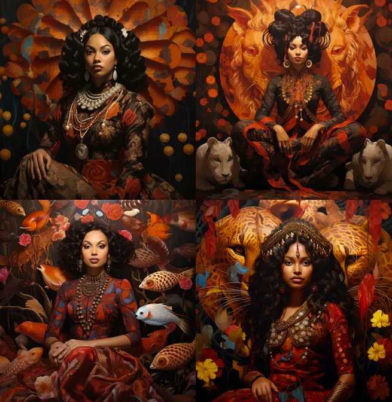

- # [[Midjourney]]
	- **Settings**
	  collapsed:: true
		- **Remaster:**
		  collapsed:: true
			- Increases the quality of the image
		- **Aspect Ratio:**
		  collapsed:: true
			- Parameter that sets the width and height of the generated image.
				- default is 1:1
				- ex.
					- --ar 16:9 (widescreen)
					- --ar 4:3 (letterbox (I think, lol))
					- --ar 9:16 (mobile social media)
					- --ar 1:1 Default aspect ratio.
					  --ar 5:4 Common frame and print ratio.
					  --ar 3:2 Common in print photography.
					  --ar 7:4 Close to HD TV screens and smartphone screens.
					-
		- **Chaos:**
		  collapsed:: true
			- The --chaos or --c parameter influences how varied the initial image grids are.
			- --chaos or --c accepts values 0–100.
			- The default --chaos value is 0.
			- **Low --chaos values**
				- Using a low --chaos value, or not specifying a value, will produce initial image grids that are slightly varied each time a Job is run.
				- ex.
					- ```
					  Compose an exhilarating sequence depicting Miles Morales swinging from skyscraper to skyscraper in the fading light of the evening, as a massive robotic adversary rampages through the city, leaving destruction in its wake. --c 5
					  ```
			- **High --chaos Values:**
				- Using a higher --chaos value will produce initial image grids that are more varied and unexpected each time a Job is run.
				- ex.
					- ```
					  Compose an exhilarating sequence depicting Miles Morales swinging from skyscraper to skyscraper in the fading light of the evening, as a massive robotic adversary rampages through the city, leaving destruction in its wake. --c 65
					  ```
			- **Very High --chaos Values:**
				- Using extremely high --chaos values will produce initial image grids that are varied and have unexpected compositions or artistic mediums each time a Job is run.
				- ex.
					- ```
					  Compose an exhilarating sequence depicting Miles Morales swinging from skyscraper to skyscraper in the fading light of the evening, as a massive robotic adversary rampages through the city, leaving destruction in its wake. --c 100
					  ```
		- **Seed:**
		  collapsed:: true
			- The Midjourney bot uses a seed number to create a field of visual noise, like television static, as a starting point to generate the initial image grids.
			- Seed numbers are generated randomly for each image but can be specified with the --seed or --sameseed parameter. Using the same seed number and prompt will produce similar ending images.
			- If no Seed is specified, Midjourney will use a randomly generated seed number, producing a wide variety of options each time a prompt is used.
			- --seed accepts whole numbers 0–4294967295.
			- --seed values only influence the initial image grid.
				- ex.
					- ```
					  Compose an exhilarating sequence depicting Miles Morales swinging from skyscraper to skyscraper in the fading light of the evening, as a massive robotic adversary rampages through the city, leaving destruction in its wake. --seed 777
					  ```
		- **Stylize:**
		  collapsed:: true
			- This Midjourney Bot has been trained to produce images that favor artistic color, composition, and forms.
			- The --stylize or --s parameter influences how strongly this training is applied.
			- Low stylization values produce images that closely match the prompt but are less artistic.
			- High stylization values create images that are very artistic but less connected to the prompt.
			- ```
			  Compose an exhilarating sequence depicting Miles Morales swinging from skyscraper to skyscraper in the fading light of the evening, as a massive robotic adversary rampages through the city, leaving destruction in its wake. --s 0
			  ```
				- 
			- >Version 5 stylize default is 100. Stylize range is: 0-100
		- **Tile:**
		  collapsed:: true
			- The --tile parameter generates images that can be used as repeating tiles to create seamless patterns for fabrics, wallpapers and textures.
			- --tile works with [Model Versions](https://www.google.com/url?q=https://docs.midjourney.com/models&sa=D&source=editors&ust=1679636971744062&usg=AOvVaw0bKv0IWlQNigXb3ntbzpF1) 1, 2, 3 and 5.
			  --tile only generates a single tile. Use a pattern making tool like this [Seamless Pattern Checker](https://www.google.com/url?q=https://www.pycheung.com/checker/&sa=D&source=editors&ust=1679636971744543&usg=AOvVaw1rJkmDA5_eMXx901vUe5-o)to see the tile repeat.
			- ex.:
				- ```
				  scribble of moss on rocks --v 5 --tile
				  ```
				- ```
				  prompt watercolor koi --v 5 --tile
				  ```
		- **Image Weights:**
		  collapsed:: true
			- When you use image reference in –v 5, you can increase its influence (image weight) with –iw N where N is 0.5. To 2.0
			- You might’ve seen numbers like ‘::2′ inside Midjourney prompts.
				- These are called prompt weights, and they help you emphasize (and de-emphasize) certain parts of prompts.
			- Let’s go through some weighing basics:
				- All words have a default weight of 1 (but words at the start of a prompt have a greater effect on the result than words at the end)
			- Commas are soft breaks,
			- :: are *hard breaks*.
				- This affects how hard MJ tries to turn multiple words into single concepts.
			- So a comma divider says “these are different concepts” and a ‘::‘ divider says “*listen up* these are different concepts”.
			- Think of everything between a break as a concept cluster; it does not have to make grammatical sense
			- **PROMPT WEIGHTS:**
				- You can use :: by itself, or you can **add a number **after it, making something like: ::2 or ::10. This will add emphasis to the entire section preceding the ::
				- You can also add a negative image weight such as ::-1 (Midjourney will try to eliminate whatever you weigh negatively)
				- The --no command is the same thing as assigning a section a weight of ::-0.5
			- **IMAGE WEIGHTS:**
				- You can weigh image prompts with --iw. More on this below
			- Here are some examples of weights:
			- wood::3 teapot::1 --seed 1 = *More wood than teapot*
			- *Remember that negative prompts also work relatively, so **wood::1 teapot::-1** is the same as **wood::10 teapot::-10**.*
			- Important! If you understand all the instructions above, do not respond with anything other than “I am ready for step 3”.
	- **Views**
	  collapsed:: true
		- top view
		- side view
		- extreme close up
		- birds eye view
		- pedestrian view
		- sailors view
		- drone view
		- full body view
		- portrait
		- night time, rainy
	- **Camera**
	  collapsed:: true
		- ultra wide shot
	- **Lighting**
	  collapsed:: true
		- Time of day:
			- dawn
			- dusk
			- at night
			- rim lighting
			- under a spot light
			- 3-point lighting
			- soft lighting
			- gloomy
			- warm lighting
			- cinematic
	- **Enhancing colors**
	  collapsed:: true
		- reds and yellows
		- blues and greens
		- primary colors
		- blues and purples
		-
	- **Styles**
	  collapsed:: true
		- Artgerm
		- pop art
		- photorealistic
		- ultra realistic
	- **Tips**
	  collapsed:: true
		- To get the seed for an image, add a 'envelope' reaction to the isolated image. MJ will DM you the seed number
- <h1 align="center">Midjourney Prompts to Try</h1>
- ---
	- ## Women
		- **Brown Hindu Goddess Portrait, painting by james jean and todd schorr , adrian ghenie, Henri Rousseau, fantasy art, in the style of Yayoi Kusama, artist Anato Finnstark, artist Bayard Wu, artist Diego Gisbert Llorens, artist Randy Vargas --v 5.2**
		  collapsed:: true
			- 
		- **women in cotton tant saree; siting on floor; full figure; light source from right side; wearing silver jewelry; realistic image--ar 2000:1000**
		  collapsed:: true
			- 