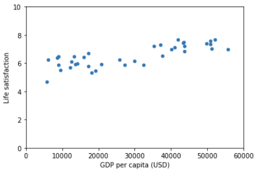
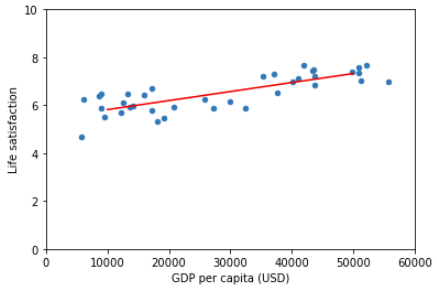

- # [[Hands-On Machine Learning with Scikit-Learn, Keras, and TensorFlow]]
# Chapter 1: The [[Machine Learning]] Landscape
- ---
## What is [[Machine Learning]]?
collapsed:: true
	- Machine Learning is the art & science of programming computers to learn
	  from data.
		- > \[Arthur Samuel\] ML is the field of study that gives computers the
		  > ability to learn without being explicitly programmed.
	- A more formal definition:
		- > \[Tom Mitchell\] A computer program is said to learn from experience
		  > $E$ with respect to some task $T$ and some performance measure $P$, if
		  > its performance on $T$, as measured by $P$, improves with experience
		  > $E$.
## Why use [[Machine Learning]]?
collapsed:: true
	- When building non-learners, we usually follow these steps:
		- We make rules
		- We write an algorithm
		- If the algorithm performs well, we deploy. If not, we go back to step `1`
	- However, if the problem is complex, we\'ll likely endup with a long list of rules that are hard to maintain and scale to other similar problems. An ML system would be much shorter, easier to maintain, and in many cases, more accurate.
	- We can simply train an algorithm on a large dataset, then inspect the algorithm's  [[feature importance]] coefficient to gain a better understanding of the relation between the data & the problem. This is called [[data mining]].
- ---
## Examples of Applications
collapsed:: true
	- ML has many applications, the following are a few notable ones:
	- [[Image Classification]]: typically performed using [[convolutional neural networks]].
	- [[Semantic segmentation]]: the algorithm is trained to classify each
	    pixel in an image, one example of this is brain tumor detection.
	- [[Natural Language Processing]] (NLP): More specifically, text
	    classification, which can be learned using [[RNN]]s, [[CNN]]s, or
	    [[Transformers]].
	- [[Chatbots]]: Involve many NLP tasks such as [[Natural Language Understanding]] (NLU) and Question Answering.
	- Forecasting future revenue: a [[regression]] task that can be tackled using multiple algorithms such as:
		- [[Linear Regression]]
		- [[Polynomial Regression]]
id:: baa50e66-ed17-491d-bffe-a108e7bb73e1
		- [[SVM]]
id:: 61ef5bdd-81d9-430f-9ffe-b46b47965695
		- [[Random Forest]]
		- [[Artificial Neural Networks]]
	- [[Speech recognition]]: this problem can be tackled by recognizing the incoming audio signals using [[RNN]]s, [[CNN]]s or [[Transformers]].
	- Credit card fraud detection: detecting frauds can be solved using [[Supervised Learning]] ([[classification]]) or [[Unsupervised Learning]] ([[anomaly detection]])
	    learning.
	- [[Clustering]]: segmenting clients based on their purchases so we can design targeted & more effective marketing campaigns.
	- [[Dimensionality reduction]]: useful for high-dimensional data visualization and [[cluster analysis]] . It can be solved using algorithms such as [[PCA]] or [[T-SNE]].
	- [[Recommender systems]]: where we can feed in the sequence of client purchases (for example) to an [[artificial neural network]] to predict the next purchase.
- ---
- ## Types of [[Machine Learning]] Systems
  collapsed:: true
	- [[Machine learning algorithms]] can be classified according to the amount of supervision they get during training,
	- There are 4 major types of ML algorithms:
	- ### [[Supervised Learning]]
	  collapsed:: true
		- The training set we feed into the algorithm contains the targets/labels/desired predictions.
			- ### [[Supervised Learning Tasks]]
				- [[Classification]]
					- We are interested in predicting discrete values
						- ex: is the email spam  or not spam .
				- [[Regression]]
					- Deals with continuous target values
						- ex: predict the price of houses in dollars.
		- Some regression-based models are used for classification as well, such as [[Logistic Regression]] which outputs a probability $\in [0,1]$.
			- ### [[Supervised Learning Algorithms]]
				- [[K-nearest Neighbors]]
				- [[Linear Regression]]
				- [[Logistic Regression]]
				- [[Decision Trees and Random Forests]]
				- [[Artificial Neural Networks]]
				- [[Naive Bayes]]
	- ### [[Unsupervised Learning]]
	  collapsed:: true
		- Data is unlabeled
		- The system is trying to learn without a teacher by finding internal structure within the dataset.
		- ### [[Algorithms]]
			- [[Clustering]]
				- [[K-means]]
				- [[DBSCAN]]
				- [[Hierarchical Cluster Analysis]]
			- [[Anomaly Detection]]
				- [[one-class SVM]]
				- [[Isolation Forest]]
				- [[Auto-encoders]]
			- [[Dimensionality Reduction]]: The goal is to compress the data without losing too much information.
				- One way to do it is to merge highly correlated features
				- ### Aspects of [[Dimensionality reduction]]
					- [[Principal Component Analysis]]: [[PCA]]
					- [[t-distributed stochastic Neighbor Embedding]]: [[T-SNE]]
					- [[Autoencoders]]
					- [[Kernel PCA]]
					- [[Local Linear Embedding]] (LLE)
			- [[Association rule learning algorithms]] find interesting relations between attributes
				- [[Apriori]]
				- [[Eclat]]
	- ### [[Semi-supervised Learning]]
	  collapsed:: true
		- Partially-labeled data.
		- The goal is to to use unlabeled data around the labeled data as helpers to solve the task.
		- Most [[semi-supervised learning algorithms]] are a combination of [[Unsupervised Learning Algorithms]] and [[Supervised Learning Algorithms]] .
	- ### [[Reiforcement Learning]]
	  collapsed:: true
		- An agent observes the environment, selects an action, gets a reward, and updates its policy.
		- We can also categorize ML systems to **[[Batch Algorithms]]** or **[[Online Algorithms]]**.
			- The question is is whether the algorithm will learn from an incoming stream of data or not.
	- ### [[Batch Algorithms]] vs. [[Online Algorithms]]
	  collapsed:: true
		- In [[Batch Learning]] , the model is incapable of [[Incremental Learning]],
		  collapsed:: true
			- It starts by learning from all of the available data offline, and then gets deployed to produce predictions without feeding it any new data points.
				- Another name of [[Batch Learning]] is [[Offline Learning]].
		- In [[Online Learning]] , we train the data incrementally by continuously feeding it data instances as they come.The ML system performs well on the training data but fails to generalize.
		  collapsed:: true
			- Individually or in small groups of instances called *mini-batches*.
			- Each learning step is fast and cheap, so the system can learn as data comes, on the fly.
			- Great for systems that receive data in a continuous flow.
			- One important aspect of online learning is how fast the learning algorithm should adapt to new data points or to changes to the overall data distribution.
			- With a big learning rate, the model tends to forget past data and lean heavily towards new data points.
			- With a small learning rate, the model tends to slightly adapt to new data points but keeps its knowledge on old data points mostly intact.
id:: 40eecfac-f742-4332-b2d2-31199497183e
			- ### Challenges
				- Can be damaged with bad incoming data points and clients will notice that on the fly.
					- To mitigate this, we can closely monitor the system through performance metrics and turn off online learning or revert back to a previous model state.
					- We have to also make sure we clean the data before feeding it to the model by conducting anomaly/outlier detection.
	- ### [[Instance-Based Learning]] vs. [[Model-Based Learning]]
	  collapsed:: true
		- One other way to categorize [[Machine Learning Algorithms]] is how they generalize.
		  collapsed:: true
			- There are two approaches to generalization:
				- instance-based approaches
				- model-based approaches.
		- With [[Instance-Based Learning]] , we perform similarity-based comparisons,
		  collapsed:: true
			- a new data point would be classified based on its similarity to the target group in the training set, this would require a measure of similarity.
		- In [[Model-Based Learning]], we build a model for each class of data points and then use the model to classify a new data point
		  collapsed:: true
			- (from the validation/test/production environment).
			- Let's go through an example of [[Model-Based Learning]] using [[Linear Regression]]:
			  collapsed:: true
				- collapsed:: true
				  ```python
				  import numpy as np
				  import pandas as pd
				  import matplotlib.pyplot as plt
				  import seaborn as sns
				  import sklearn.linear_model
				  ```  
				  
				  ```python
				  # URLs for data
				  gdp_data_url = 'https://educational-data-samples.s3.amazonaws.com/books/hands-on-ML/WEO_Data.csv'
				  oecd_data_url = 'https://educational-data-samples.s3.amazonaws.com/books/hands-on-ML/OECD.csv'
				  ```  
				  
				  ```python
				  # get data & import it as a dataframe
				  gdp = pd.read_csv(gdp_data_url, sep='\t', encoding='latin1', thousands=',', na_values='n/a').dropna()
				  gdp.head()
				  ```  
				  
				  ```python
				  # get oecd data & import it as a dataframe
				  oecd = pd.read_csv(oecd_data_url, thousands=',')[['Country', 'Indicator', 'Measure', 'Inequality', 'Unit', 'PowerCode', 'Value']]
				  oecd.head()
				  ```
					- Output:
					  collapsed:: true
						- |     | Country         | Indicator                    | Measure | Inequality          | Unit       | PowerCode | Value |
						  |-----|-----------------|------------------------------|---------|---------------------|------------|-----------|-------|
						  | 0   | Australia       | Labour market insecurity     | Value   | Total               | Percentage | Units     | 5.4   |
						  | 1   | Austria         | Labour market insecurity     | Value   | Total               | Percentage | Units     | 3.5   |
						  | 2   | Belgium         | Labour market insecurity     | Value   | Total               | Percentage | Units     | 3.7   |
						  | 3   | Canada          | Labour market insecurity     | Value   | Total               | Percentage | Units     | 6.0   |
						  | 4   | Czech Republic  | Labour market insecurity     | Value   | Total               | Percentage | Units     | 3.1   |
				- collapsed:: true
				  ```python
				    # Get countries + Life satisfaction
				    oecd = oecd[['Country', 'Value']][oecd['Indicator'] == 'Life satisfaction']
				    oecd = oecd.rename(columns={'Value': 'Life satisfaction'})
				    oecd.head()
				    ```
					- Output
					  collapsed:: true
						- |       | Country           | Life satisfaction |
						  |-------|-------------------|------------------:|
						  | 1812  | Australia         |               7.3 |
						  | 1813  | Austria           |               7.1 |
						  | 1814  | Belgium           |               6.9 |
						  | 1815  | Canada            |               7.4 |
						  | 1816  | Czech Republic    |               6.7 |
				- collapsed:: true
				   ```python
				    # Get countries + GDP
				    gdp = gdp[['Country', '2015']]
				    gdp = gdp.rename(columns={'2015': 'GDP per capita (USD)'})
				    # filter to get a similar dataframe to the book's
				    gdp = gdp[gdp['GDP per capita (USD)'] <= 60000]
				    gdp.head()
				    ```
					- Output
					  collapsed:: true
						- |     | Country            | GDP per capita (USD) |
						  |-----|--------------------|---------------------:|
						  | 0   | Afghanistan        |              599.994 |
						  | 1   | Albania            |             3995.383 |
						  | 2   | Algeria            |             4318.135 |
						  | 3   | Angola             |             4100.315 |
						  | 4   | Antigua and Barbuda|            14414.302 |
				- collapsed:: true
				  ```python
				    # Join GDP & Life satisfaction tables + Group by country as the unique column and average-aggregate GDP & Life satisfaction
				    country_stats = pd.merge(gdp, oecd, on='Country').groupby(['Country']).mean().reset_index()
				    country_stats.head()
				    ```
					- Output
					  collapsed:: true
						- |     | Country   | GDP per capita (USD) | Life satisfaction |
						  |-----|-----------|---------------------|------------------:|
						  | 0   | Australia |          50961.865  |             7.350 |
						  | 1   | Austria   |          43724.031  |             7.225 |
						  | 2   | Belgium   |          40106.632  |             7.000 |
						  | 3   | Brazil    |           8669.998  |             6.400 |
						  | 4   | Canada    |          43331.961  |             7.425 |
				- collapsed:: true
				  ```python
				    # get GDP for the x-axis and Life Satisfaction for the y-axis
				    X = country_stats['GDP per capita (USD)'].values.reshape(-1, 1)
				    y = country_stats['Life satisfaction'].values.reshape(-1, 1)
				    X.shape, y.shape
				    ```
					- Output
					  collapsed:: true
						- ((37, 1), (37, 1))
				- collapsed:: true
				  ```python
				    # Visualize Data
				    country_stats.plot(kind='scatter', x='GDP per capita (USD)', y='Life satisfaction', xlim=(0, 60000), ylim=(0,10))
				    plt.show()
				    ```
					- Output
					  collapsed:: true
						- 
				- collapsed:: true
				  ```python
				    # Select a Linear Model
				    model = sklearn.linear_model.LinearRegression()
				    ```  
				  
				    ```python
				    # Train the Model
				    model.fit(X, y,)
				    ```
					- Output
					  collapsed:: true
						- LinearRegression(copy_X=True, fit_intercept=True, n_jobs=None, normalize=False)
				- collapsed:: true
				  ```python
				    # Make a prediction for Cyprus
				    X_new = [[22587]]  # Cyprus GDP per capita
				    print(model.predict(X_new))
				    ```
					- Output
					  collapsed:: true
						- [[6.2910907]]
				- collapsed:: true
				   ```python
				    # let's visualize our model, because it's a linear one, we can plot it using two points
				    X = [[10000], [50000]]
				    y_hat = model.predict(X)
				    ```  
				  
				    ```python
				    # Visualize Data
				    country_stats.plot(kind='scatter', x='GDP per capita (USD)', y='Life satisfaction', xlim=(0, 60000), ylim=(0,10))
				    plt.plot(X, y_hat, c='red')
				    plt.show()
				    ```
					- Output
					  collapsed:: true
						- 
		- In summary, we go through the following steps to deploy an ML algorithm:
			- 1. We study the data: [[Exploratory Data Analysis]] (EDA)
			- 2. We select the model
			- 3. We train the model
			- 4. We infer using the model
- ---
- ## Main Challenges of [[Machine Learning]]
  collapsed:: true
	- The two things that can go wrong with a machine learning project are:
		- Collecting bad data.
		- Picking a bad learning algorithm
	- ### [[Data]]
		- Data quantity can be a big problem. Even for very simple ml algorithms,
			- it takes thousands of examples for a [[Convolutional Neural Network]] to recognize Cat/Dog in images.
		- A famous paper showed that many algorithms, ranging from very simple ones to complex, perform relatively the same when given enough data.
			- The authors argued that companies should reconsider where to invest their money, in algorithms development or in data corpus engineering.
		- The training sample can also be non-representative of the source dataset.
		- In order to generalize well, It\'s important that our training data be representative of the data that we want to use in production.
			- If, for example, the training set is too small, we will have [[Sampling Noise]].
			- Even large samples can be non-representative if the sampling method is flawed, this is called **[[Sampling Bias]]**
				- ex: [[Non-Response Bias]].
		- Poor quality data can also be a big challenge.
			- If our training data is full of outliers, errors, and noise, it will make it harder for the algorithm to detect the underlying patterns, resulting in a bad model.
			- It\'s always better to properly clean and investigate the data before doing any modeling.
				- Examples of data cleaning:
					- [[Outlier Detection]] and cleaning by either removing or replacing the outlier values.
					- Cleaning missing features by either:
						- discarding their instances
						- filling them with median/average, or
						- training an auxiliary model to predict their values.
		- It\'s almost always the case that datasets contain irrelevant features.
			- Our system will only learn if the data contains many relevant features and not so many irrelevant ones.
			- A critical part of the success of a machine learning project is what\'s called **[[Feature Engineering]]**
				- coming up with features that would produce a quality model, it contains two steps:
					- 1.  Feature selection: selecting the most useful features to analyze.
					- 2.  Feature Extraction: adding new features based of the selected ones.
					- We can also create new features by gathering new data.
	- ### [[Overfitting]]
	  collapsed:: true
		- The ML system performs well on the training data but fails to generalize.
		- Complex models such as [[deep neural networks]] tend to memorize training data noise or even the data sample itself if it is small enough. We can do the following to mitigate overfitting:
			- Select a model with fewer [[weights]]/[[parameters]] to constrain its predictive power so that it can use only the strongest present patterns.
			- Gather more training data.
			- Reduce the noise in the training data by fixing errors and eliminate outliers.
		- Constraining a model & fighting overfitting is called **[[regularization]]**.
		- If we take the example of a single [[linear regression model]] ($f(x)=ax+b$), it has two degrees of freedom ($2$ parameters).
			- If we let the algorithm change one parameter\'s values freely but have a set interval around parameter 2, it will have between 1 and 2 degree of freedom.
			- We would want a good balance between keeping the model as simple as possible while giving the model the ability to capture out of training data patterns.
			- Regularization can be controlled using the model\'s [[hyperparameters]], which describe how the model should learn.
	- ### [[Underfitting]]
	  collapsed:: true
		- Underfitting is the opposite of overfitting.
			- It occurs when the model is too simple to capture the underlying structure of the training data.
			- We present the following solutions to the problem:
				- We can select a more powerful model, with more [[parameters]]
				- We feed better features to the learning algorithm ([[Feature Engineering]])
				- We reduce the constraints on the model (reduce regularization)
- ---
- ## [[Testing]] & [[Validating]]
  collapsed:: true
	- We can evaluate our model by splitting the data into two sets: **[[Training (Machine Learning)]]** and **[[Testing (Machine Learning)]]** data sets.
		- We only care about [[out-of-training error]], or [[generalization error]], as it is representative
		  of the model\'s performance in a production environment.
		- If our training error is low but the testing error is high, this means that the model is [[Overfitting]] .
		- It\'s common to use **80%** of the data for training and the remaining 20% for testing,
			- Dependent on the size of the original data set, the bigger the data set, the less percentage we can take as a testing set.
			- If we fine-tune [[regularization parameters]] on the [[test set]], we are sort of [[overfitting]] to it
				- so we need another data set for [[hyper-parameter tuning]], this data set is usually called the **[[validation set]]**.
					- The [[validation set]] should be set aside from the training set.
					- After conducting [[hyper-parameter tuning]] on using the [[validation set]] , we train the model on the full training set (with [[validation]]) & evaluate on the [[test set]] .
			- A simple but computationally expensive solution to setting aside a large validation set is to perform repeated [[cross-validation]].
				- Its drawback is that we have to train the model N-repetitions. The [[validation set]] & [[the test set]] must be as representative as possible of the data we will use in production.
			- One Problem is that if the algorithm is performing poorly on the [[validation set]], we won\'t know if the cause is [[overfitting]] or if the training set isn\'t good for the task at hand.
				- A solution to this is to introduce another [[validation set]], called [[train-dev set]].
				- After training, we will [[validate]] the model on both [[train-dev set]] & [[validation set]].
				- If evaluation is good on [[train-dev set]] & bad on [[validation set]], this means that the data is not good for the task at hand.
				- If evaluation is bad on [[train-dev set]] & bad on [[validation set]], this means [[Overfitting]] or the algorithm/overall data is not good.
				- We should think of a model as a simplified version of the observations.
					- This simplification is meant to discard noise and capture generalizable useful patterns in the training and testing datasets.
					- To decide what information to discard and what to keep, you must make assumptions.
						- For example, a [[linear model]] assumes that the relation between the input & output is fundamentally linear & the distance between the model line and the observations is essentially **noise**.
				- If we make no assumptions about the data, than there is no need to prefer one model over another. This is the point behind the "[[no free lunch theorem]]", which states the following:
					- > Any two optimization algorithms are equivalent when > their performance is averaged across all possible problems. - David Wolpert & William Macready
- ---
- ## Exercises
  collapsed:: true
	- **How would you define Machine Learning?** #Question #MachineLearning
	- Machine Learning is the computer\'s ability to learn from data without
	  being explicitly programmed.
	- **Can you name four types of problems where it shines?** #Question #MachineLearning
		- Image classification, Voice Recognition, Semantic Segmentation,
		  Sentiment Analysis.
	- **What is a labeled training set?** #Question #MachineLearning
		- In the context of supervised learning, a labeled training set is a data
		  set with available targets. Meaning that what you want to predict is
		  known before training.
			- Example: a training set composed of images of cats or dogs and the
			  corresponding **label** (cat/dog) for each of the images.
	- **What are the two most common supervised tasks?** #Question #MachineLearning
		- Classification (where the target is categorical in nature) & Regression
		  (where the labels\' domain is continuous).
	- **Can you name four common unsupervised tasks?** #Question #MachineLearning
		- Clustering, Anomaly detection, Visualization, dimensionality reduction.
	- **What type of machine learning algorithm would you use to allow a robot to walk in many paths in an unknown terrain?** #Question #MachineLearning
		- Reinforcement learning.
	- **What type of algorithm would you use to segment your customers into multiple groups?** #Question #MachineLearning
		- An unsupervised clustering algorithm like [[K-means Algorithm]] or [[DBSCAN Algorithm]] .
	- **Would you frame the problem of spam detection as a supervised learning or an unsupervised learning problem?** #Question #MachineLearning
		- It a supervised learning problem.
	- **What is an online learning system?** #Question #MachineLearning
		- An online learning system continues to learn from new data after being deployed in production, in contrast to a batch learning model which would stop learning after the initial training process.
	- **What is out-of-core learning?** #Question #MachineLearning
		- We use out-of-core learning algorithms when the training data can\'t fit in a computer\'s RAM.
	- **What type of learning algorithm relies on a similarity measure to make predictions?** #Question #MachineLearning
		- Instance-based models, an example of this is K-nearest neighbors.
	- **What is the difference between a model\'s parameters and a learning algorithm\'s hyper-parameter?** #Question #MachineLearning
		- Model parameters are the knobs that, collectively, store the learned knowledge of the model, also called weights, they are continuously changed during training to minimize a cost function. Examples are a & b in the linear model: $f(x) = ax + b$.
		- A learning algorithm\'s hyper-parameter describes how the algorithm should learn and control the predictive power of the model, example is the learning rate, number of layers in a NN, number of parameters, batch size, they are set before training and aren\'t changed during training.
	- **What do model-based algorithms search for?** #Question #MachineLearning
		- A decision boundary.
	- **What is the most common strategy they use to succeed?** #Question #MachineLearning
		- They minimize a cost function that describe the distance between the predictions outputted by the model and the real target values.
	- **How do they make predictions?** #Question #MachineLearning
		- They start with a set of initial parameters, make predictions based on the input & their parameters, then adjust their parameters to minimize cost.
	- **Can you name 4 of the main challenges in machine learning?** #Question #MachineLearning
		- For algorithmic challenges: Model Overfitting, Model Underfitting.
		- Data challenges include: Data mismatch, Noisy data.
	- **If your model performs great on the training data but fails on the test data, What is happening?** #Question #MachineLearning
		- Overfitting, the model starts memorizing noise present on the training data to further minimize the cost function.
	- **Can you name 3 possible solutions?** #Question #MachineLearning
		- Regularization, Adding more data, Simplifying the model.
	- **What is a test set? & Why you would want to use it?** #Question #MachineLearning
		- The whole data set is usually split into training and testing data sets, we use test data to evaluate the generalizability of the model beyond the training data set.
	- **What is the purpose of a validation set?** #Question #MachineLearning
		- A validation set is used to fine-tune the models\' hyper-parameters, what is called manual training. It leaves the test set for the final evaluation.
	- **What is the [[train-dev set]] ? When do you use it? & How do you use it?** #Question #MachineLearning
		- The [[train-dev set]] is a validation set that is taken from a broad training set after performing the train/validation/test split. We use it when we have a broad training data set (ex. images of all animals) but specific validation/test set (zoo animal pics taken with mobile phones) and we want to correctly interpret the model\'s evaluation.
		- We train the model on the training data set, we evaluate on [[train-dev set]] and [[validation set]] , if model performs badly on both, we have an overfitting case, if the model performs good in [[train-dev set]] and badly on [[validation set]] we have a data mismatch, we conclude that the learning doesn\'t generalize to our specific production data.
	- **What can go wrong if you tune hyper-parameters using the test set?** #Question #MachineLearning
		- We can accidentally overfit to the test set by manually finding [[Hyper-Parameters]] that perform well on the test set but doesn\'t generalize to production data.