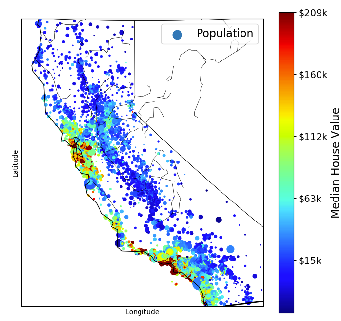
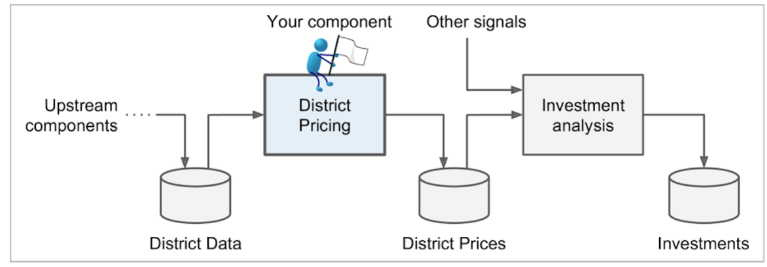
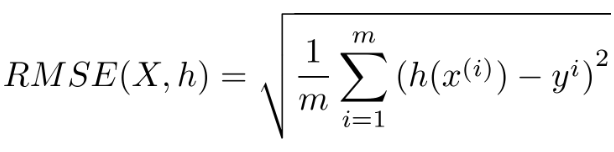
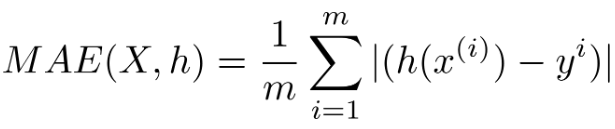

- # [[Hands-On Machine Learning with Scikit-Learn, Keras, and TensorFlow]]
	- <h1 align="center">Chapter 2: End-to-End Machine Learning Project</h1>
	- ***
	- [[Terms and Definitions]]
	  collapsed:: true
		- [[Signal]]:
			- >A piece of information fed to a machine learning system is often called a signal, in reference to Claude Shannon’s information theory, which he developed at Bell Labs to improve telecommunications. His theory: you want a high signal-to-noise ratio.
		- [[Pipelines]]:
			- A sequence of data processing components is called a data pipeline.
			- They are very common in ML systems due to large amount of data and many data transformation requirements.
				- Components typically run [asynchronously (https://en.wikipedia.org/wiki/Asynchronous_system).
					- Each component:
					  * Pulls a large amount of data
					  * Processes it
					  * Spits out the result in another data store for another component
				- The interface between components is simple the data store. So different teams can focus on different components.
				- The architecture is robust - if a component fails, the component downstream can keep using the previous output of the failed component.
				- Thus, without proper monitoring a broken component can go unnoticed. The data gets stals and the overall performance drops.
	- Popular open-data repositories:
	  collapsed:: true
		- [UC Irvine Machine Learning Repository](https://archive.ics.uci.edu/ml/)
		- [Kaggle datasets](https://www.kaggle.com/datasets)
		  id:: 6494998c-881c-4034-8278-5665a9de66e8
		- [Amazon's AWS datasets](https://registry.opendata.aws/)
		  id:: 6494998e-cf73-4f9f-a786-f80788da9cfe
	- Meta portals (they list open data repositories)
	  collapsed:: true
		- [http://dataportals.org](http://dataportals.org)
		- [http://opendatamonitor.eu](http://opendatamonitor.eu)
		- [http://quandl.com](http://quandl.com)
	- Other pages listing many popular open data repositories:
	  collapsed:: true
		- [Wikipedia's list of Machine Learning datasets](https://en.wikipedia.org/wiki/List_of_datasets_for_machine_learning_research)
		  id:: 649499bf-be0c-4f78-a3f4-d7baca27227d
		- [Quora.com question](https://www.quora.com/Where-can-I-find-large-datasets-open-to-the-public)
		  id:: 649499c5-a8f9-422d-8044-af32397041fc
		- [Datasets subreddit](https://www.reddit.com/r/datasets)
		  id:: 649499cd-295f-4521-82af-975fc3e2b631
	- # [[Machine Learning]] [[Projects]]
	  collapsed:: true
		- ## California Housing Prices
			- ## [[Workflow]]
			  collapsed:: true
				- Look at the big picture.
				- Get the data.
				- Explore and visualize the data to gain insights
				- Prepare the data for machine learning algorithms
				- Select a model and train it.
				- Fine-tune your model.
				- Present your solution.
				- Launch, monitor, and maintain your system.
				-
			- ## Goal
			  collapsed:: true
				- Your model should learn from the data and be able to predict the median housing
				  price in any district, given all the other metrics.
			- ## What We will be Using?
			  collapsed:: true
				- We will be using the [California Housing Prices dataset](https://www.dcc.fc.up.pt/~ltorgo/Regression/cal_housing.html). It contains dataset from 1990 California Census.
				- |  |
				  |:----------------------------------------------:|
				  | *California Housing prices* |
				-
			- ## Look at the Big Picture
			  collapsed:: true
				- First task - build a model of housing prices in California using California census data. This data has metrics:
				  |Metrics         |Property  |
				  |:--------------:|:--------:|
				  |longitude       |continuous|
				  |latitude        |continuous|
				  |housingMedianAge|continuous| 
				  |totalRooms      |continuous| 
				  |totalBedrooms   |continuous| 
				  |population      |continuous|
				  |households      |continuous| 
				  |medianIncome    |continuous|
				  |medianHouseValue|continuous|
				  
				  These metrics represent values for each block group in california. Block groups are the smallest geographical unit for which the US Census Board publishes sample data. We will call the "districts" for short.
				  
				  **Given all other metrics, model should be able to predict the median housing price in any district.**
				  >First thing you do is to pull out your Machine Learning project checklist.
				  ***
			- ## Frame the Problem
			  collapsed:: true
				- ### First Question
				  collapsed:: true
					- Ask the client what is the business objective?
						- Knowing the objective is important because it will determine:
						  * how you frame the problem
						  * which algorithms you will select
						  * which performance measure you will use to evaluate your model
						  * and how much effort you will spend tweaking it
					- **Answer**:
					  collapsed:: true
						- The model's output (prediction of price in a block) will be fed to another ML system along with many signals.
						- This system will predict whether it is worth investing in this block.
							- |  |
							  |:-------------------------------------------------:|
							  | *A Machine Learning Pipeline for Real Estate Investments* |
				- ### Second Question
				  collapsed:: true
					- What the current solution looks like (if any).
					- It gives you a reference performance, as well as insights on how to solve the problem.
					- **Answer**:
					  collapsed:: true
						- An expert team gathers information about district and estimate price using complex rules.
						- This is costly and time-consuming. They often realize that their estimates were off by more than 10%.
				- ### Finally! Framing the Problem
				  collapsed:: true
					- It is clearly a ** [[Supervised Learning Tasks]] ** - given all the other params predict the label, median house price.
					- * It is a **[[Regression Tasks]]** - prediction is a real value number.
					- * It is **multivariate regression problem**.
					- * There is no continuous flow of data coming in the system, there is no particular need to adjust to changing data rapidly, and the data is small to fit in the memory, so plain **batch learning** should do just fine.
					  
					  ***
					  > If the data was huge, you could either split your batch learning work across multiple servers, or you could use an online learning technique instead.
					  ***
			- ## Select Performance Measure
			  collapsed:: true
				- A typical performance measure for regression problems is the [[Root Mean Squared Error]] (RMSE).
					- 
					- This equation introduces several common ML notations. See <a href="./ML_NOTATIONS.md" traget='_blank'>here</a>.
				- In some context we may choose a different performance measure function. For example, suppose there are many outlier districts, then [[Mean Absolute Error]] (MAE) might be considered as a better choice.
					- 
				- For other possibilities of distance functions (or performance functions) check the <a href="./ML_NOTATIONS.md" traget='_blank'>notations markdown</a>.
			- ## Check the Assumptions
			  collapsed:: true
				- List and verify assumptions made so far.
				- This can catch serious issues early on.
				- Example, If the downstream ML system, before using the predicted price, converts it to three categories - "cheap", "medium" and "expensive". Then we don't need our system to predict price perfectly. We just need category right. Then this becomes a classification task.
			- ## Let's Dirty Our Hands!!
			  collapsed:: true
				- [Creating the workspace](./workspace_creation.md)
				- [End-to-End Project](./Housing.ipynb)
				  
				  ***
				  > [End-to-End Project](./Housing.ipynb) contains **more notes**, with simple code from book.
				  
				  > [Creating the workspace Markdown](./workspace_creation.md) and [Notations markdown](./ML_NOTATIONS.md) are separate as they can be referred to again and again, and are linked in the root README.md.
				  ***