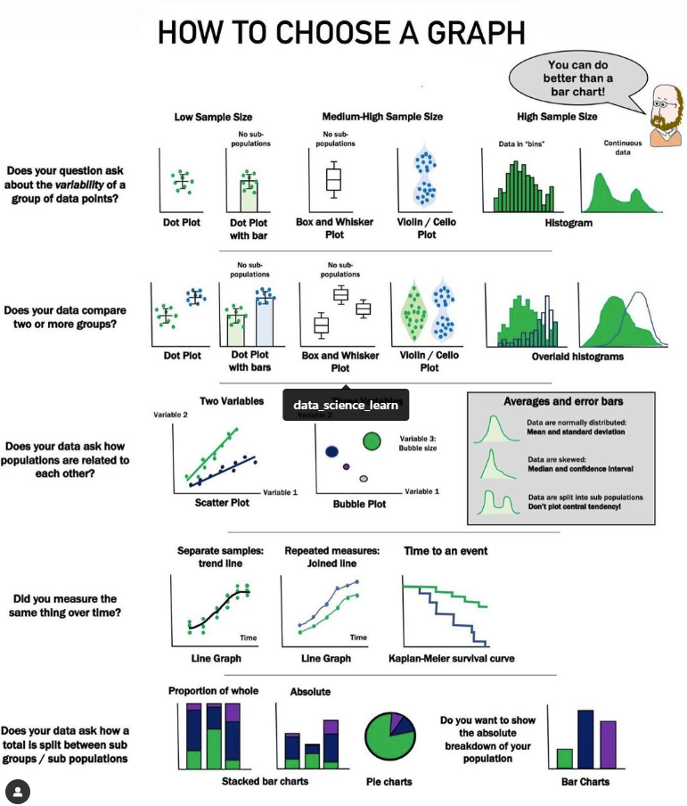

- # [[Operations.Numpy]] [[Data Science]]
  collapsed:: true
	- ### Creating an Array
	  collapsed:: true
		- ``` python
		  import numpy as np
		  
		  # creating an arrary from a list
		  my_list = [1, 2, 3, 4, 5]  
		  my_array = np.array (my_list)  
		  print(my_array)  
		  
		  [1 2 3 4 5]  
		  
		  # creating an array with a range of values
		  my_array = np.arange (0,10,2)  
		  print(my_array)  
		  
		  [0 2 4 6 8]
		  ```
	- ### Accessing Elements
	  collapsed:: true
		- ``` python
		  # accessing a single element 
		  my_array = np.array ([1,2,3,4,5]) print(my_array[2])
		  
		  3 
		  
		  # accessing a range of elements 
		  my_array = np.array ([1,2,3,4,5]) print(my_array[1:4])
		  
		  [2 3 4]
		  ```
	- ### Reshaping an Array
	  collapsed:: true
		- ```python
		  # reshaing an array
		  my_array = np.array ([1,2,3,4,5,6])
		  reshaped_array = my_array.reshape (2,3)
		  print(reshaped_array)
		  
		  [[1 2 3][4 5 6]]
		  ```
	- ### Concatenating Arrays
	  collapsed:: true
		- ```python
		  # concatenating arrays
		  array1 = np.array([1,2,3])
		  array2 = np.array([4,5,6])
		  con_array = np.concatenate((array1, array2))
		  print(con_array)
		  
		  [1 2 3 4 5 6]
		  ```
	- ### Transposing an Array
	  collapsed:: true
		- ```python
		  # transposing an array
		  my_array = np.array([[1, 2, 3], [4, 5, 6]])
		  tposed_array = np.transpose(my_array)
		  print(tposed_array)
		  
		  [[14][25][36]]
		  ```
	- ### Computing [[Mean]] , [[Median]] , and [[Standard Deviation]]
	  collapsed:: true
		- ```python
		  import numpy as np
		  
		  # Computing mean, median, and standard deviation
		  my_array = np.array([1, 2, 3, 4, 5])
		  mean = np.mean(my_array)
		  median = np.median(my_array)
		  std_dev = np.std(my_array)
		  print("Mean:", mean)
		  print("Median:", median)
		  print("Standard Deviation:", std_dev)
		  
		  Mean: 3.0
		  Median: 3.0
		  Standard Deviation 1.4142135623730951
		  ```
	- ### Computing [[Correlation Coefficient]]
	  collapsed:: true
		- ```python
		  import numpy as np
		  
		  # Computing correlation coefficient
		  array1 = np.array([1, 2, 3, 4, 5])
		  array2 = np.array([5, 4, 3, 2, 1])
		  corr_coef = np.corrcoef(array1, array2)
		  print(corr_coef)
		  
		  [[1.-1.][-1.1.]]
		  ```
- # [[Algorithms]] [[DSAs]]
  collapsed:: true
	- [[Linear Search]]
	- [[Binary Search]]
	- [[Bubble Sort]]
	- [[Insertion Sort]]
	- [[Selection Sort]]
	- [[Quick Sort]]
	- [[Merge Sort]]
	- [[Heap Sort]]
	- [[Counting Sort]]
	- [[Radix Sort]]
	- [[Bucket Sort]]
	- [[Depth-First Search (DFS)]]
	- [[Breadth-First Search (BFS)]]
	- [[Dijkstra's Algorithm]]
	- [[Bellman-Ford Algorithm]]
	- [[Floyd-Warshall Algorithm]]
	- [[Prim's Algorithm]]
	- [[Kruskal's Algorithm]]
	- [[Topological Sort]]
	- [[Dynamic Programming]]
	- [[Knapsack Problem]]
	- [[Traveling Salesman Problem (TSP)]]
	- [[Convex Hull]]
	- [[Maximum Flow]]
	- [[Minimum Spanning Tree]]
- # [[Algorithms.Searching]] [[DSAs]]
  collapsed:: true
	- [[Linear Search]]
	- [[Binary Search]]
	- [[Interpolation Search]]
	- [[Jump Search]]
	- [[Exponential Search]]
	- [[Fibonacci Search]]
	- [[Hashing]]
	- [[Ternary Search]]
	- [[Depth-First Search (DFS)]]
	- [[Breadth-First Search (BFS)]]
	- [[A* Search Algorithm]]
	- [[Dijkstra's Algorithm]]
	- [[Bellman-Ford Algorithm]]
	- [[Prim's Algorithm]]
	- [[Kruskal's Algorithm]]
- # [[Patterns.Coding]] [[DSAs]]
  collapsed:: true
	- [[Sliding Window]]
	- [[Two Pointers]]
	- [[Binary Search]]
	- [[Fast and Slow Pointers]]
	- [[Merge Intervals]]
	- [[Top K Elements]]
	- [[K-way Merge]]
	- [[Breadth-First Search (BFS)]]
	- [[Depth-First Search (DFS)]]
	- [[Backtracking]]
	- [[Dynamic Programming (DP)]]
	- [[Kadane's Algorithm]]
	- [[Knapsack Problem]]
	- [[Tree Depth-First Search]]
	- [[Tree Breadth-First Search]]
	- [[Topological Sort]]
	- [[Trie]]
	- [[Graph - Bipartite Check]]
	- [[Bitwise XOR]]
	- [[Sliding Window - Optimal]]
- # [[Commands.Git]]
  collapsed:: true
	- git init:
		- Initialize repository.
	- git clone <repo>:
		- Clone repository.
	- git add <file>:
		- Add file.
	- git commit -m "Message":
		- Commit changes.
	- git push:
		- Push changes.
	- git pull:
		- Pull changes.
	- git branch:
		- List branches.
	- git checkout <branch>:
		- Switch branch.
	- git merge <branch>:
		- Merge changes.
- # [[Commands.Linux]]
  collapsed:: true
	- ls:
		- List files and directories.
	- cd:
		- Change directory.
	- mkdir:
		- Create a directory.
	- rm:
		- Remove files and directories.
	- cp:
		- Copy files and directories.
	- mv:
		- Move or rename files and directories.
	- cat:
		- Display file content.
	- grep:
		- Search for patterns in files.
	- sudo:
		- Execute a command with administrative privileges.
	- ssh:
		- Connect to a remote server securely.
- # [[Projects.Flutter]]
  collapsed:: true
	- ## Instagram clone (Flutter + Firebase)
	- ## Whatsapp clone (Flutter + NodeJS + SocketIO)
	- ## Amazon clone (Flutter + Supabase)
	- ## TicTacToe game (Core Flutter)
	- ## ChatGPT integrated app
- # [[Concepts.SQL]]
- # [[Questions.SQL]]
  collapsed:: true
	- What is SQL?
	  collapsed:: true
		- SQL (Structured Query Language) is a programming language used for managing relational databases. It allows users to store, manipulate, and retrieve data from databases.
	- What are the different types of SQL statements?
	  collapsed:: true
		- SQL statements can be categorized into three types:
			- [[Data Definition Language (DDL)]]:
				- Used for creating, altering, and dropping database objects.
			- [[Data Manipulation Language (DML)]]:
				- Used for querying, inserting, updating, and deleting data.
			- [[Data Control Language (DCL)]]:
				- Used for controlling access to the database, granting or revoking privileges.
	- What is a primary key?
	  collapsed:: true
		- A primary key is a column or a set of columns that uniquely identifies each record in a table. It ensures data integrity and allows efficient retrieval of data.
	- What is a foreign key?
	  collapsed:: true
		- A foreign key is a column or a set of columns in a table that refers to the primary key of another table. It establishes a relationship between the two tables.
	- What is a composite key?
	  collapsed:: true
		- A composite key is a primary key composed of two or more columns. Together, these columns uniquely identify each record in a table.
	- What is the difference between DELETE and TRUNCATE?
	  collapsed:: true
		- DELETE is a DML statement used to remove specific rows from a table, whereas TRUNCATE is a DDL statement used to remove all rows from a table, effectively resetting the table.
	- What is a self-join?
	  collapsed:: true
		- A self-join is a join operation where a table is joined with itself. It is useful when you want to compare rows within the same table.
	- What are the different types of JOIN operations?
	  collapsed:: true
		- The different types of JOIN operations are:
			- INNER JOIN: Returns only the matching rows from both tables.
			- LEFT JOIN: Returns all rows from the left table and matching rows from the right table.
			- RIGHT JOIN: Returns all rows from the right table and matching rows from the left table.
			- FULL JOIN: Returns all rows from both tables.
	- What is normalization in SQL?
	  collapsed:: true
		- Normalization is the process of organizing data in a database to eliminate redundancy and dependency issues. It involves splitting tables into smaller, more manageable entities.
	- What are the different normal forms in database normalization?
	  collapsed:: true
		- The different normal forms are:
			- First Normal Form (1NF): Eliminates duplicate rows and ensures atomicity of values.
			- Second Normal Form (2NF): Ensures that each non-key column depends on the entire primary key.
			- Third Normal Form (3NF): Ensures that each non-key column depends only on the primary key and not on other non-key columns.
			- Fourth Normal Form (4NF): Eliminates multi-valued dependencies.
			- Fifth Normal Form (5NF): Eliminates join dependencies.
	- What is an index?
	  collapsed:: true
		- An index is a database structure that improves the speed of data retrieval operations on database tables. It allows faster searching, sorting, and filtering of data.
	- What is a clustered index?
	  collapsed:: true
		- A clustered index determines the physical order of data in a table. Each table can have only one clustered index, and it is generally created on the primary key column(s).
	- What is a non-clustered index?
	  collapsed:: true
		- A non-clustered index is a separate structure from the table that contains a sorted copy of selected columns. It provides a faster way to search for data but does not dictate the physical order of the data in the table.
	- What is ACID in database transactions?
	  collapsed:: true
		- ACID stands for Atomicity, Consistency, Isolation, and Durability. It is a set of properties that ensure reliability and integrity in database transactions.
	- What is the difference between UNION and UNION ALL?
	  collapsed:: true
		- UNION combines the result sets of two or more SELECT statements and removes duplicates
		- UNION ALL combines the result sets without removing duplicates.
	- What is a view?
	  collapsed:: true
		- A view is a virtual table derived from one or more tables. It does not store data but provides a way to present data in a customized or simplified manner.
	- What is a stored procedure?
	  collapsed:: true
		- A stored procedure is a precompiled set of SQL statements that performs a specific task. It can be called and executed multiple times with different parameters.
	- What is a trigger?
	  collapsed:: true
		- A trigger is a set of SQL statements that are automatically executed in response to a specific event, such as INSERT, UPDATE, or DELETE operations on a table.
	- What is a transaction?
	  collapsed:: true
		- A transaction is a logical unit of work that consists of one or more database operations. It ensures that all operations within the transaction are treated as a single unit, either all succeeding or all failing.
	- What is a deadlock?
	  collapsed:: true
		- A deadlock is a situation where two or more transactions are unable to proceed because each is waiting for a resource held by another transaction. This can result in a perpetual wait state.
	- What is the difference between CHAR and VARCHAR data types?
	  collapsed:: true
		- CHAR is a fixed-length character data type that stores a specific number of characters
		- VARCHAR is a variable-length character datatype that stores a varying number of characters.
	- What is the difference between a function and a stored procedure?
	  collapsed:: true
		- A function returns a value and can be used in SQL statements, whereas a stored procedure performs actions and may or may not return a value.
	- What is the difference between a database and a schema?
	  collapsed:: true
		- A database is a collection of related data that is stored and organized.
		- A schema, on the other hand, is a logical container within a database that holds objects like tables, views, and procedures.
	- What is a data warehouse?
	  collapsed:: true
		- A data warehouse is a large repository of data collected from various sources, structured and organized to support business intelligence and reporting.
	- What is the difference between OLTP and OLAP?
	  collapsed:: true
		- OLTP (Online Transaction Processing) is used for day-to-day transactional operations and focuses on real-time processing.
		- OLAP (Online Analytical Processing) is used for complex analytical queries and focuses on historical data analysis.
	- What is a correlated subquery?
	  collapsed:: true
		- A correlated subquery is a subquery that references columns from the outer query. It is executed for each row of the outer query, making it dependent on the outer query's results.
	- What is the difference between a temporary table and a table variable?
	  collapsed:: true
		- A temporary table is a physical table that is created and used temporarily within a session or a specific scope.
		- table variable is a variable with a structure similar to a table and exists only within the scope of a user-defined function or a stored procedure.
	- What is the difference between UNION and JOIN?
	  collapsed:: true
		- UNION combines rows from two or more tables vertically
		- JOIN combines columns from two or more tables horizontally based on related columns.
	- What is the difference between WHERE and HAVING clauses?
	  collapsed:: true
		- WHERE is used to filter rows before grouping in a query, while HAVING is used to filter grouped rows after grouping.
	- What is the difference between a database and a data warehouse?
	  collapsed:: true
		- A database is a collection of related data organized for transactional purposes.
		- A data warehouse is a large repository of data organized for analytical purposes.
	- What is the difference between a primary key and a candidate key?
	  collapsed:: true
		- A candidate key is a column or a set of columns that can uniquely identify each record in a table.
		- A primary key is a chosen candidate key that becomes the main identifier for the table.
	- What is a recursive SQL query?
	  collapsed:: true
		- A recursive SQL query is a query that refers to its own output in order to perform additional operations. It is commonly used for hierarchical or tree-like data structures.
	- What is the difference between a correlated subquery and a nested subquery?
	  collapsed:: true
		- A correlated subquery is a subquery that references columns from the outer query,
		- while a nested subquery is a subquery that is independent of the outer query.
	- What is the difference between a natural join and an equijoin?
	  collapsed:: true
		- A natural join is a join operation that automatically matches columns with the same name from both tables.
		- An equijoin is a join operation that explicitly specifies the join condition using equality operators.
	- What is the difference between an outer join and an inner join?
	  collapsed:: true
		- An inner join returns only the matching rows from both tables.
		- An outer join returns all rows from one table and matching rows from the other table(s).
	- What is the difference between a left join and a right join?
	  collapsed:: true
		- A left join returns all rows from the left table and matching rows from the right table.
		- A right join returns all rows from the right table and matching rows from the left table.
	- What is a full outer join?
	  collapsed:: true
		- A full outer join returns all rows from both tables including unmatched rows, and combines them based on the join condition.
	- What is a self-referencing foreign key?
	  collapsed:: true
		- A self-referencing foreign key is a foreign key that references the primary key of the same table. It is used to establish hierarchical relationships within a single table.
	- What is the purpose of the GROUP BY clause?
	  collapsed:: true
		- The GROUP BY clause is used to group rows based on one or more columns. It is typically used with aggregate functions to perform calculations on each group.
	- What is the purpose of the HAVING clause?
	  collapsed:: true
		- The HAVING clause is used to filter grouped rows based on specific conditions. It operates on the result of the GROUP BY clause and is used to further filter the grouped data.
	- What is the purpose of the DISTINCT keyword?
	  collapsed:: true
		- The DISTINCT keyword is used to retrieve unique values from a column in a result set, eliminating duplicate rows.
	- What is the purpose of the LIKE operator?
	  collapsed:: true
		- The LIKE operator is used in a WHERE clause to search for a specified pattern in a column. It allows the use of wildcard characters such as '%' (matches any sequence of characters) and '_' (matches any single character).
	- What is the purpose of the IN operator?
	  collapsed:: true
		- The IN operator is used in a WHERE clause to check if a value matches any value in a list or a subquery.
	- What is the purpose of the BETWEEN operator?
	  collapsed:: true
		- The BETWEEN operator is used in a WHERE clause to check if a value lies within a specified range of values, inclusive of the endpoints.
	- What is the purpose of the EXISTS operator?
	  collapsed:: true
		- The EXISTS operator is used in a WHERE clause to check if a subquery returns any rows. It returns true if the subquery result set is not empty.
- # [[Terms.Data Science]]
	- **[[Data Warehouse]]**
		- A centralized repository of structured and semi-structured data collected from various sources within an organization, designed to support efficient querying, reporting, and analytics.
	- **[[Data Mart]]**
		- A smaller, specialized version of a data warehouse focusing on a particular subject or department, serving specific business needs or user groups.
	- **[[Data Lake]]**
		- A centralized storage system that stores large volumes of raw, unstructured, and semi-structured data from various sources, designed for big data and real-time analytics.
	- **[[Delta Lake]]**
		- An open-source storage layer that brings ACID transactions to Apache Spark and big data workloads, providing versioning, schema enforcement, and performance optimizations for data lakes.
	- **[[Data Pipeline]]**
		- A set of processes and tools used to ingest, process, and move data from one system to another, handling data integration, transformation, and processing tasks.
	- **[[Data Mesh]]**
		- A decentralized, domain-oriented approach to data platform architecture and organizational design, treating data as a product with individual teams responsible for their own domainspecific data products.
	- **[[MNIST]]**
		- A dataset primarily use for classification -based tasks.
	- **[[Classification]]**
		-
- # [[Concepts.Data Science]]
  collapsed:: true
	- ## [[Outliers]]
	  collapsed:: true
		- **[[Outliers]]:**
			- Data points that are considerably different from the majority of the data and may indicate errors, abnormalities, or rare events.
		- **[[Outlier detection]]:**
			- Also known as anomaly detection, is a data analysis technique used to identify observations that deviate significantly from the expected or normal behavior of a dataset.
			- Detecting outliers can provide valuable insights, help in identifying data quality issues, or highlight unusual patterns or events in the data.
		- **Importance of Outlier Detection**
		  collapsed:: true
			- Outlier detection is important for several reasons:
				- **Data Quality**:
					- Outliers can be indicative of data entry errors, measurement inaccuracies, or data corruption. Detecting and addressing outliers improves the quality and reliability of the data.
				- **Anomaly Detection**:
					- Outliers can represent rare or interesting events, patterns, or behaviors in the data that require further investigation. They can help identify novel insights, potential risks, or opportunities.
				- **Model Performance**:
					- Outliers can distort statistical analyses, machine learning models, or predictive algorithms. By detecting and mitigating outliers, the accuracy and robustness of these models can be improved.
				- **Decision Making**:
					- Outliers may influence decisions based on data analysis. By understanding and managing outliers, better-informed decisions can be made, leading to more accurate predictions or effective interventions.
		- **Example: Housing Prices**
		  collapsed:: true
			- Suppose we have a dataset containing information about housing prices in a particular neighborhood. The dataset includes features such as the area of the house, the number of bedrooms, the location, and the selling price. Our goal is to identify any outliers in the dataset.
			- **Data exploration:**
				- First, we need to explore the dataset to understand its distribution and characteristics. We can visualize the data using scatter plots, histograms, or box plots to identify any_potential outliers.
				- For instance, plotting the distribution of housing prices might reveal a majority of houses clustered around a certain price range, but there could be a few data points with unusually high or low prices.
		- **Detection: Statistical methods**
		  collapsed:: true
			- Several statistical methods can be employed to detect outliers.
			- One common approach is to use measures such as the z-score or the interquartile range (IQR).
			- **[[Z-score]]:**
				- The z-score measures how many standard deviations a data point is away from the mean of the dataset. Any data point with a z-score beyond a certain threshold, typically a value of 2 or 3 , can be considered an outlier.
			- **[[Interquartile range (IQR)]]:**
				- The IQR is the range between the first quartile (Q1) and the third quartile (Q3) of the dataset. Data points falling below Q1-1.5 * IQR or above Q3 + 1.5 * IQR are considered outliers.
			- **[[Algorithms.Machine Learning]]**
				- Various machine learning algorithms, such as [[isolation forests]], [[local outlier factor (LOF)]], or [[oneclass support vector machines (SVM)]] , can be employed to identify outliers. These algorithms use patterns, densities, or distances in the data to isolate and classify anomalies.
			- **[[Domain Knowledge]]**
				- Understanding the domain and context of the data is crucial in outlier detection.
				- Subject matter experts can contribute their knowledge to determine what constitutes an outlier based on specific domain characteristics or requirements.
			- **Iterative Refinement**
				- Outlier detection is an iterative process that involves analyzing the detected outliers, investigating their causes, and deciding whether they are genuine anomalies or data errors. Additional data sources, expert consultation, or further investigations can be utilized to validate or resolve the outliers.
				-
		- ### Summary
		  collapsed:: true
			- Outliers are data points that significantly deviate from the normal behavior of a dataset.
			- Outliers can indicate errors, anomalies, rare events, or interesting patterns in the data.
			- Detecting outliers is important for improving data quality, identifying risks or opportunities, enhancing model performance, and making informed decisions.
			- Outliers can be detected using statistical methods, machine learning algorithms, and domain knowledge.
			- Statistical methods include techniques like z-score or interquartile range (IQR) to identify outliers based on deviations from the mean or quartiles of the data.
			- Machine learning algorithms such as isolation forests, local outlier factor (LOF), or one-class support vector machines (SVM) can be used to detect outliers by analyzing patterns, densities, or distances in the data.
			- Domain knowledge is crucial in outlier detection, as experts can contribute their understanding of the domain to determine what constitutes an outlier.
			- Outlier detection is an iterative process that involves refining and validating the detected outliers.
			- By effectively detecting and addressing outliers, organizations can gain valuable insights, ensure data accuracy and reliability, and make informed decisions based on trustworthy data.
	- ## [[Moving Averages]]
	  collapsed:: true
		- The concept of moving averages revolves around the idea that by averaging neighboring data points, you can reduce the impact of short-term fluctuations and reveal underlying trends or patterns in the data.
		- Moving averages are particularly useful in smoothing out noise and identifying long-term trends.
		- Moving averages are widely used statistical tools in data analysis and time series forecasting.
		- They provide a smoothed representation of a series of data points by calculating the average value of a subset of adjacent points over a specified window or period.
			- The window can be of fixed length or can be a variable based on certain criteria.
		- **[[Simple Moving Average (SMA)]]**
		  collapsed:: true
			- **Calculation:**
				- The simple moving average is calculated by summing up the values of a specified number of data points and dividing the sum by the number of points.
			- **Uses:**
				- SMA is used to identify trends, support and resistance levels, and to generate trading signals. It is widely applied in technical analysis of financial markets.
		- **[[Weighted Moving Average (WMA)]]**
		  collapsed:: true
			- **Calculation:**
				- The weighted moving average assigns different weights to each data point within the window. The weights decrease linearly, giving more importance to recent values.
			- **Uses:**
				- WMA is useful when recent data points are considered more significant than older ones. It is often used in financial forecasting or demand forecasting where recent observations carry more weight.
		- **[[Exponential Moving Average (EMA)]]**
		  collapsed:: true
			- **Calculation:**
				- The exponential moving average assigns exponentially decreasing weights to each data point within the window. The weight decreases exponentially, giving more weight to recent values.
			- **Uses:**
				- EMA is commonly used in finance and technical analysis. It reacts more swiftly to recent changes compared to SMA or WMA and is useful for short-term trend analysis.
		- ### Uses
		  collapsed:: true
			- **Trend Identification:**
				- Moving averages help identify the direction and strength of trends in a dataset, making them valuable in trend analysis and forecasting.
			- **Noise Reduction:**
				- By smoothing out shortterm fluctuations, moving averages provide a clearer picture of the underlying patterns and can eliminate noise in the data.
			- **Support and Resistance Levels:**
				- Moving averages can act as support or resistance levels in technical analysis, helping traders identify potential entry or exit points.
		- ### Summary
		  collapsed:: true
			- Types of Moving Averages:
				- [[Simple Moving Average (SMA)]]
				- [[Weighted Moving Average (WMA)]]
				- [[Exponential Moving Average (EMA)]]
			- Uses of Moving Averages:
				- Trend Identification
				- Noise Reduction
				- Support and Resistance Levels
				- Signal Generation
				- Forecasting
	- ## [[Big Data]]
	  collapsed:: true
		- **Volume:**
			- The sheer quantity of data we generate is staggering. From digital transactions and social media interactions to IoT devices, every byte of data has the potential to be mined for insights. The challenge and opportunity lie in our ability to handle, analyze, and interpret this astronomical amount of information.
		- **Variety:**
			- Big Data is not only about text or numbers; it includes an array of data types - structured, semi-structured, and unstructured. This diversity, which spans from social media posts to machine sensor data, provides a rich tapestry of insights waiting to be unraveled.
		- **Value:**
			- Amidst the ocean of data, finding the pearls of actionable insights is where the true value lies. It's about transforming raw data into a meaningful understanding that empowers informed decision-making, innovation, and improved user experiences.
		- **Velocity:**
			- The speed at which new data is created, processed, and analyzed is another crucial aspect. Real-time processing can fuel quick, data-driven decisions, proving vital in areas like finance, healthcare, and cybersecurity.
		- **Veracity:**
			- In the world of Big Data, quality is as important as quantity. Ensuring the accuracy, reliability, and consistency of data is paramount. After all, decisions based on inaccurate data can lead to negative outcomes.
- # [[Questions.Data Science]]
  collapsed:: true
	- We looked at a process of using a test set and a training set to drive iterations of model development. On each iteration, we'd train on the training data and evaluate on the test data, using the evaluation results on test data to guide choices of and changes to various model hyperparameters like learning rate and features. Is there anything wrong with this approach? (Pick only one answer.)
		- Doing many rounds of this procedure might cause us to implicitly fit to the peculiarities of our specific test set.
		- Yes indeed! The more often we evaluate on a given test set, the more we are at risk for implicitly overfitting to that one test set. We'll look at a better protocol next.
- # [[Terms.SQL]]
  collapsed:: true
	- ## [[DDL: Data Definition Language]]
	  collapsed:: true
		- Define database [[schema]] in [[DBMS]]
		- Commands:
			- [[CREATE]]
			  id:: 64a6aff0-b58b-4f11-a5cc-2cdd207d860d
			- [[DROP]]
			- [[ALTER]]
			- [[TRUNCATE]]
	- ## [[DML: Data Manipulation Language]]
	  collapsed:: true
		- Manipulate data present in the DB
		- Commands:
			- [[INSERT]]
			- [[UPDATE]]
			- [[DELETE]]
	- ## [[DCL: Data Control Language]]
	  collapsed:: true
		- Deals with access rights and data control on the data present in the DB
		- Commands:
			- [[GRANT]]
			- [[REVOKE]]
	- ## [[TCL: Transaction Control Language]]
	  collapsed:: true
		- Deals with the [[transactions]] happening in the DB
		- Commands:
			- [[COMMIT]]
			- [[ROLLBACK]]
	- ## [[DQL: Data Query Language]]
	  collapsed:: true
		- Retrieve data from the DB using SQL queries
		- Commands:
			- [[SELECT]]
- # [[Commands.SQL]]
  collapsed:: true
	- ((64a6aff0-b58b-4f11-a5cc-2cdd207d860d))
- # [[Operations.SQL]]
  collapsed:: true
	- ## Create a database
	  collapsed:: true
		- ```sql
		  create database sample2
		  ```
	- ## Use the database
	  collapsed:: true
		- ```sql
		  use sample2
		  ```
	- ## Create table
	  collapsed:: true
		- ```sql
		  create table customer 
		  ( 
		  customerid int identity(1,1) primary key, 
		  customernumber int not null unique check (customernumber > 0), 
		  lastname varchar(30) not null, 
		  firstname varchar(30) not null, 
		  areacode int default 71000, 
		  address varchar(50), 
		  country varchar(50) default 'Malaysia' 
		  )
		  ```
	- ## Insert values into table
	  collapsed:: true
		- ```sql
		  insert into customer values 
		  (100,'Fang Ying', 'Sham','418999','sdadasfdfd', default), 
		  (200,'Mei Mei','Tan', default,'adssdsadsd','Thailand'), 
		  (300,'Albert','John',default,'dfdsfsdf', default)
		  ```
	- ## Display record from table
	  collapsed:: true
		- ```sql
		  --display all records
		  select * from customer
		  
		  -- display particular columns
		  select customerid, customernumber, lastname, firstname
		  from customer
		  ```
	- ## Add new column to table
	  collapsed:: true
		- ```sql
		  alter table customer
		  add phonenumber varchar(20)
		  ```
	- ## Add values to newly added column/Update table
	  collapsed:: true
		- ```sql
		  update customer set phonenumber ='1234545346' where customerid = 1
		  update customer set phonenumber ='45554654' where customerid = 2
		  ```
	- ## Delete a column
	  collapsed:: true
		- ```sql
		  alter table customer
		  drop column phonenumber
		  ```
	- ## Delete record from table
	  collapsed:: true
		- --If you do not put a 'where' clause, all records get deleted
			- ```sql
			  delete
			  from customer
			  where country='Thailand'
			  ```
	- ## Delete table
	  collapsed:: true
		- ```sql
		  drop table customer
		  ```
	- ## Change data type
	  collapsed:: true
		- ```sql
		  alter table customer
		  alter column phonenumber varchar(10)
		  ```
- # [[Workflows.Data Analysis]]
  collapsed:: true
	- 
- # [[Workflows.Data Analysis]] [[Importing]]
  collapsed:: true
	- **Data Sources:**
		- ((6494998c-881c-4034-8278-5665a9de66e8))
		- ((6494998e-cf73-4f9f-a786-f80788da9cfe))
		- ((649499bf-be0c-4f78-a3f4-d7baca27227d))
		- ((649499c5-a8f9-422d-8044-af32397041fc))
		- ((649499cd-295f-4521-82af-975fc3e2b631))
		- UCI Machine Learning Repository
		- Google Dataset search
		- Data.gov
	- **Data Collection and Cleaning**
		- Once you have identified the data sources, collect the data based on the chosen methods.
		- Clean and preprocess the data to handle missing values, outliers, and inconsistencies.
		- Perform data transformations, normalization, or feature engineering as needed.
	- **Ensure Data Privacy and Compliance**
		- When collecting and using data, ensure compliance with data privacy regulations, such as GDPR or CCPA.
		- Anonymize or pseudonymize personal data, obtain necessary consent, and adhere to ethical guidelines throughout the data collection and usage process.
	- **Conduct [[Exploratory Data Analysis (EDA)]]**
		- Perform exploratory data analysis on the available sources to assess the feasibility and suitability of the data for your project.
		- Explore the data's structure, quality, completeness, and relevance to your project goals.
	- **Data Integration and Fusion**
		- If your project requires combining multiple datasets, perform data integration and fusion to merge and consolidate the data into a unified format.
		- Ensure that the merged data maintains the integrity, consistency, and relevance to your project goals.
	- **Validate and Document**
		- Validate the collected data against your project objectives to ensure its usefulness and correctness.
		- Document the data sources, preprocessing steps, and any assumptions made during the data collection process. This documentation will be valuable for reproducibility and transparency.
	- >Correction: EDA Can be done with the available sources before jumping into collecting more Data. Also EDA should be done before merging the Data from different sources into one.